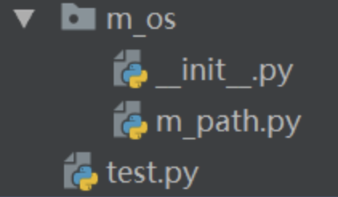
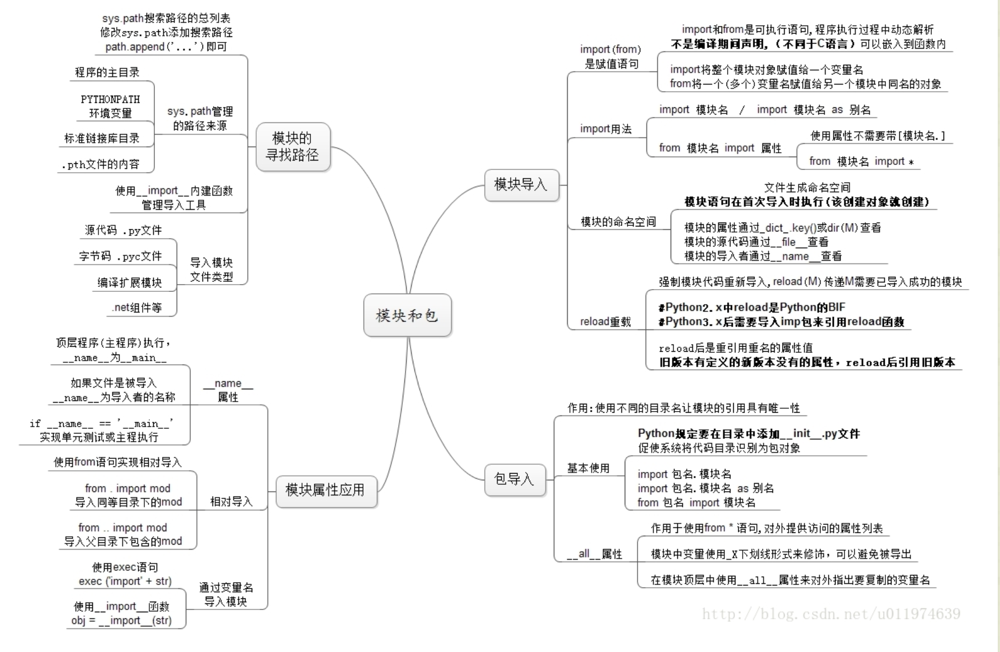

# python自定义模块


## 1. 导入自定义模块
### 1.1 导入文件与当前文件在同一目录

<font color=red >** 直接引入: import m_path 或 from m_path import \* **
</font>

```
m_path.py:
    def getfile():
    print('get file:\n')
test.py:
    import m_path
    m_path.getfile()
```
### 1.2 导入文件在同级目录下某文件夹folder下
在folder下，建立空__init__.py的文件，将文件夹转为包。然后引用：
from m_os import m_path 或 from m_os.m_path import *



### 1.3 相对路径导入

将自定义的包放在搜索目录可见的范围内。

Python会在以下路径中搜索它想要寻找的模块：
#### 1.3.1 程序所在的文件夹
#### 1.3.2 标准库的安装路径
标准库安装路径为$PYTHONHOME$\Lib\site-packages。可将包直接放到此目录下，也可在此目录下新建一个.pth文件，比如说是MyPackage.pth，里面的内容是你的包的绝对路径比如：E:/PythonPrj。（推荐做法）
#### 1.3.3 操作系统环境变量PYTHONPATH所包含的路径
将自定义库的路径添加到Python的库路径中去，动态的添加库路径。在程序运行过程中修改sys.path的值，添加自己的库路径。
import sys
sys.path.append('your_path')
对执行了sys.path.append命令的当前Python运行环境起作用，对其他运行环境不起作用，也即“一次性”的。

## 2. 详解Python中的from .. import绝对导入语句

导入一个模块可以指定使用绝对或者包相对的导入。
### 2.1 绝对导入:
使用一个 from \__future__ import absolute_import，可以使import string 将总是寻找基本库，而不是用户定义，以避免混淆。

示例1：
例如：在模块A.B.C中的代码:
目录结构：
```
A/
  B/
    D(当前目录)
  E/
  F/
    G
```

from . import D
\# 导入A.B.D
from .. import E
\# 导入A.E
from ..F import G
\# 导入A.F.G，.. 和 F是连着的，中间没有空格

**<font color=red>\.代表当前目录，\..代表上一层目录，\...代表上上层目录。</font>**

示例2：
目录结构：
```
package/
  __init__.py
  moduleA.py
  subpackage1/
    __init__.py
    moduleX.py
    moduleY.py
  subpackage2/
    __init__.py
    moduleZ.py

```
在subpackage1/moduleX.py 或者 subpackage1/__init__.py中可以这样导入module：
```
from .moduleY import spam
from .moduleY import spam as ham
from . import moduleY
from ..subpackage1 import moduleY
from ..subpackage2.moduleZ import eggs
from ..moduleA import foo
from ...package import bar
from ...sys import path
```
注意，from ...sys import path是合法的，但是不建议。直接from sys import path就行了。

参考：http://www.jb51.net/article/87080.htm

## 3. 作为脚本来运行程序

所有的模块都有一个内置属性__name__，如果import一个模块，那么模块的__name__属性返回值一般是文件名。如果直接运行Python程序，__name__的值将是一个"__mian__"。
根据上面程序做一个测试：
```
def func(a, b):
    return a * b
class MyClass:
    def __init__(self, a, b):
        self.a = a
        self.b = b
    def method(self):
        return self.a * self.b
print __name__
# python test.py
__main__

```
创建一个test2.py，导入这个模块：
```
import test
# python test2.py
test
```
test就是这个模块名。根据这个特性可以判断是手动执行这个程序还是导入包。
```
if __name__ == "__main__":
    print "我在手动执行这个程序..."
```
## 4. github上模块地址
http://pypi.python.org

## 5. 模块和包(Modules and Packages)
[模块和包（网页链接）](https://blog.csdn.net/u011974639/article/details/70666592)

[^_^]:本地目录：Python/python-grammar/Modules&Packages.md



