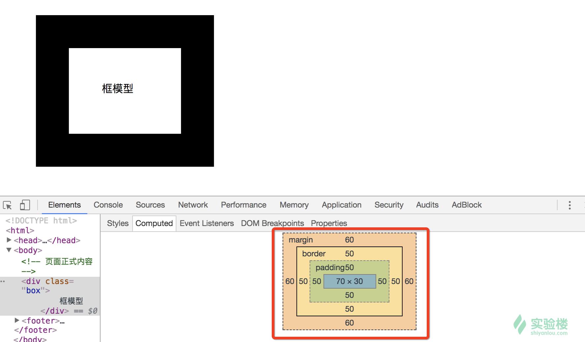
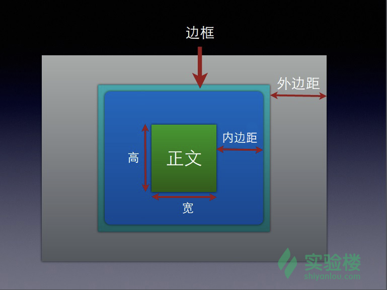
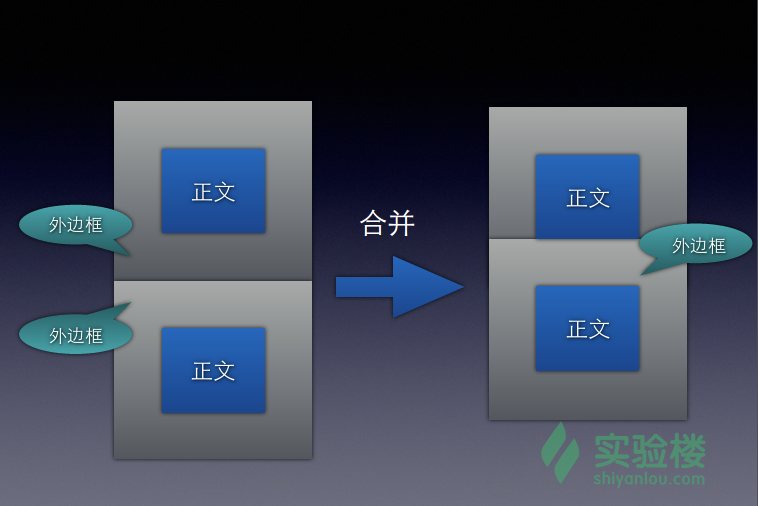

## 表单

```html
<legend>表单示例</legend>
<form action="" method="POST" id="form1">

    <input type="text" autofocus="autofocus" required  name="auto" placeholder="必填项测试">
    <input type="email" placeholder="请输入邮箱" name="mail">
    <input type="url" name="url" placeholder="输入正确的网址">
    <input type="password" name="password" placeholder="输入密码">
    <br>
    <br>
    <input type="submit" value="提交表单">
</form>

```

上面的代码，我们通过 \<form> 标签定义了一个表单，该表单向网站提交数据时，使用 HTTP POST 方法。接着通过 \<input> 标签定义了四个输入框。

第一个输入框通过 required 属性指明了该输入框是必填项；
第二个输入框使用 type 属性设置了输入的内容必须是邮件样式的文本，
第三个输入框设置了输入的文本必须是 URL 类型的，
最后一个输入框为 password 类型，当用户输入内容时，将以星号显示。


HTML \<input> autofocus 属性
\<button autofocus="autofocus">

autofocus 属性是一个布尔属性。
autofocus 属性规定当页面加载时 \<input> 元素应该自动获得焦点（就是鼠标初始定点）。


## CSS

- 内嵌代码：

```HTML
<style>
body {background-color: powderblue;}
h1   {color: blue;}
p    {color: red;}
</style>
```


- 外置CSS文件

CSS 规则由两个主要的部分构成：选择器，以及一个或多个属性值
```
selector {
    property1: value1;
    property2: value2;
    ...
    propertyN: valueN;
}
======================

h1 {
   color:red;
   font-size: 40px;
}

body {
    color：green;
}
```


## CSS 选择器

- 派生选择器

通过依据元素在其位置的上下文关系来定义样式，可以使标记更加简洁。派生选择器允许你根据文档的上下文关系来确定某个标签的样式。通过合理地使用派生选择器可以使 HTML 代码变得更加整洁。比方说，你希望列表标签 \<li> 中的所有 \<strong> 元素变为红色，而不是通常的黑色，可以这样定义一个派生选择器：

```HTML
li strong{
    color: red;
}
<p>
    <strong>我是黑色，因为我不在列表当中，所以这个规则对我不起作用</strong>
</p>
<u1>
    <li><strong>我是红色。这是因为 strong 元素位于 li 元素内。</strong></li>
</u1>
分别在 style.css 和 index.html 中输入以上代码，（index.html 中已经写了 link 标签引入了 css 文件）就可以看到效果了。
```

- ID 选择器

ID 选择器可以选择设置了相同 ID 值的 HTML 元素，ID 选择器以 # 字符开始，比如：
```
#pid a{
    color:#00755f;
}
<p id="pid">
    hello css <a href="www.shiyanlou.com">shiyanlou</a>
</p>
```
可以将上面代码输入相应的文件查看效果。

这里的#pid 代表 <id = "pid"> a代表<a>标签

- 类选择器

在学习 HTML 的时候，我们知道标签可以定义类 class 属性，CSS 就可以基于该属性值也就是类名进行选择。类选择器以 . 字符开始。如下：
```
.container {
    color: red;
}
<div class="container">
    container 容器
</div>
```

- 属性选择器

HTML 标签可以设置各种属性，CSS 可以利用这些属性进行选择标签。如下:

[title] {
    color: red;
}
HTML代码：

<p title="foo">属性和值选择器</p>
如果想根据属性和属性值来选择，还可以使用下面的代码：

[title=foo] {
    color: red;
}


## 常用属性

```CSS
.container {
   color: red;
   text-align: center;
   font-size: 20px;
   font-weight: 400;
}
```


- 文本属性

属性 | 用途
- | :-: |
font | 在一个声明中设置所有字体属性
font-family | 规定文本的字体系列
font-size | 规定文本的字体尺寸
font-weight | 规定字的粗细
color | 设置文本的颜色
direction | 规定文本的书写方向
line-height | 设置行高
text-align | 规定文本的水平对齐方式
text-decoration | 规定添加到文本的装饰效果
text-indent | 规定文本块首行的缩进


- 背景属性


属性 | 用途
 - | :-: |
background | 	在一个声明中设置所有的背景属性
background-attachment	 | 设置背景图像是否固定或者随着页面的其余部分滚动
background-color | 	设置元素的背景颜色
background-image | 	设置元素的背景图像
background-position | 	设置背景图像的开始位置
background-repeat	 | 设置是否及如何重复背景图像
background-clip	 | 规定背景的绘制区域
background-origin	 | 规定背景图片的定位区域
background-size	 | 规定背景图片的尺寸

- 尺寸属性

属性	 | 用途
- | :-: |
height | 	设置元素高度
max-height | 	设置元素的最大高度
max-width | 	设置元素的最大宽度
min-height | 	设置元素的最小高度
min-width	 | 设置元素的最小宽度
width	 | 设置元素宽度

- 外边距属性

属性 | 用途
- | :-: |
margin	 | 在一个声明中设置所有外边距属性
margin-bottom	 | 设置元素的下外边距
margin-left | 	设置元素的左外边距
margin-right | 	设置元素的右外边距
margin-top | 	设置元素的上外边距

- 边框属性

属性 | 用途
- | :-: |
border | 	在一个声明中设置所有的边框属性
border-bottom	 | 在一个声明中设置所有的下边框属性
border-left	 | 在一个声明中设置所有的左边框属性
border-right | 	在一个声明中设置所有的右边框属性
border-top | 	在一个声明中设置所有的上边框属性

- 内边距属性

属性 | 用途
- | :-: |
padding	 | 在一个声明中设置所有内边距属性
padding-bottom	 | 设置元素的下内边距
padding-left | 	设置元素的左内边距
padding-right	 | 设置元素的右内边距
padding-top	 | 设置元素的上内边距

- 定位属性

属性 | 用途
- | :-: |
bottom	| 设置定位元素下外边距边界与其包含块下边界之间的偏移
clear	 | 规定元素的哪一侧不允许其他浮动元素
display	 | 规定元素应该生成的框的类型
float	 | 规定框是否应该浮动
left	 | 设置定位元素左外边距边界与其包含块左边界之间的偏移
overflow | 	规定当内容溢出元素框时发生的事情
position | 	规定元素的定位类型
right	 | 设置定位元素右外边距边界与其包含块右边界之间的偏移
top	 | 设置定位元素的上外边距边界与其包含块上边界之间的偏移
visibility | 	规定元素是否可见

属性参考：
https://developer.mozilla.org/en-US/docs/Web/CSS/Reference

## 框模型

```
* {
    margin: 0;
    padding: 0;
}

.box {
    width: 70px;
    height: 30px;
    margin: 60px;

    border-style: solid;
    border-width: 50px;

    padding: 50px;
}
```

上面的代码，先通过 * 选择器设置所有元素的外边距和内边距为 0。这是因为浏览器默认情况下会设置元素的内边距和外边距，为了不影响效果所以这里首先将其清零。接着设置了 .box 元素的宽度和高度，然后设置了内边距，边框和外边距。其中设置了边框为实线，宽度为 50px。px 是像素单位，表示一个像素的大小。设置内边距，边框和外边距不会影响元素内容的尺寸，但是会增加元素框的总尺寸。

然后在 index.html 文件的 <body> 标签内输入以下代码：
```
    <div class="box">
        框模型
    </div>

```
刷新浏览器，就可以看到如下效果：






内边距在元素的内容外，边框内。padding 属性用于控制元素的内边距，可以通过下面几个属性分别控制元素的上下左右内边距：
```
padding-top
padding-right
padding-bottom
padding-left
```
也可以直接在 padding 属性中一次性设置上下左右内边距，方法如下：
```
.box {padding: 10px;} 设置上下左右的内边距为 10 px;
.box {padding: 10px 20px 20px 10px} 设置上，右，下，左分别为 10px, 20px, 20px, 10px，按从上内边距开始顺时针方向；
.box {padding: 5px 10px} 设置上下内边距为 5px, 左右内边距为 10px;
.box {padding: 5px 4px 3px} 等价于 .box{padding: 5px 4px 3px 4px};
```
设置内边距的距离可以使用像素单位，也可以使用其他比如 em 字体大小单位, cm 厘米，或者设置成百分数，比如 .box {padding: 50%}。设置成百分数时，最终的内边距宽度是相对于其父元素的宽度计算的，外边距也是同样的计算方式。所以如果父元素的宽度发生改变，它们也会改变。

外边距的设置方法和内边距一致，可以一次性在 margin 属性中指定所有外边距的尺寸，或者通过 margin-top 等标签分别设置上下左右的外边距。

外边距在实际使用中，当两个垂直外边距相遇时，它们会合并成一个外边距。合并后的外边距的高度等于两个发生合并外边距的高度中的较大者，如下图所示：


