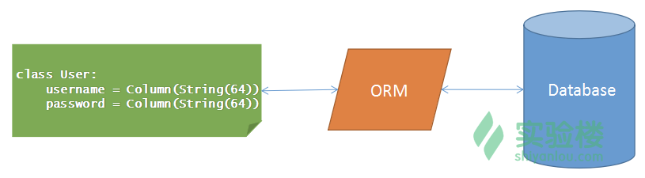

## 关系数据库 MySQL

MySQL 是应用最广泛的关系数据库。关系数据库使用关系模型作为数据组织存储的方式，可以分为四级结构：

- 数据库，比如一个应用对应一个数据库；
- 表，一个数据库包含若干张表；
- 记录，一个表包含多条记录；
- 字段，一条记录包含若干字段；

一张表的结构可以想象成一张 Excel 表，由多个字段组成，每一个字段都可以存储特定类型的数据，比如字符串或者数字，在创建表的时候可以指定类型。表与表之间通过关系连接（逻辑上的关系），查询数据时可以通过关系跨越多张表进行查询。

关系数据库最重要的特性是满足 ACID 性质：

A atomicity 代表原子性；
C consistency 代表一致性；
I isolation 代表隔离性；
D durability 代表持久性；

ACID 能够保证事务的可靠性，什么意思呢？就是说能够保证一系列的数据库操作组成的一个完整逻辑过程，要么全部被执行，要么彻底不执行，不会出现执行一半的情况。例如银行转帐，从原账户扣除金额，以及向目标账户添加金额，这两个数据库操作的总和，构成一个完整的逻辑过程，不可拆分。

为了满足 ACID 性质，MySQL 支持各种约束，比如插入一条数据时，需要检查外键是否存在，这些操作虽然能确保数据的一致性，但是很多时候却降低了并发操作的能力，所以在如今的互联网网站中，如果有高并发的需求往往不再使用关系数据库的 ACID 性质，更有的直接使用非关系数据库。

除此之外，这里再补充几点关系数据库中关系键的基本概念知识，以帮助理解下文内容。

主键（英语：primary key）。数据库表中对储存数据对象予以唯一和完整标识的数据列或属性的组合。一个数据列只能有一个主键，且主键的取值不能缺失，即不能为空值（Null）。
外键（英语：foreign key）。其实在关系数据库中，每个数据表都是由关系来连系彼此的关系，父数据表（Parent Entity）的主键（primary key）会放在另一个数据表，当做属性以创建彼此的关系，而这个属性就是外键。
比如，学生跟老师之间对应着教学关系，学生数据表会有个属性叫指导老师（外键），而这个值就是对应到老师数据表的老师代号（主键）。


- 创建数据库:create database <db_name>;
- 查看所有的数据库可以通过 show databases;
- 而删除一个数据库则可以通过 drop database <db_name>;

- 连接到 shiyanlou 数据库: use shiyanlou;

- 创建表的基本命令如下：
```
CREATE TABLE 表的名字
(
列名a 数据类型(数据长度),
列名b 数据类型(数据长度)，
列名c 数据类型(数据长度)
);
```

例子：

下面尝试创建一张表名为 user 的表，该表有 3 个字段：
```
id 编号，整数类型，使用 int 类型；
name 用户名，字符串，使用 varchar 可变字符类型；
email 邮箱，字符串, 使用 varchar 可变字符型；
在 MySQL 客户端输入下面的命令：

mysql> create database shiyanlou;
mysql> use shiyanlou;
Database changed
mysql> create table user
    -> (
    -> id int(10),
    -> name varchar(20),
    -> email varchar(64)
    -> );
Query OK, 0 rows affected (0.03 sec)
mysql> show tables;
+---------------------+
| Tables_in_shiyanlou |
+---------------------+
| user                |
+---------------------+
1 row in set (0.00 sec)
```
- show tables; 查看所有的表,
- 删除表可以通过 drop table <table_name>; 。
- 如果想查看一张表的字段信息，可以通过 show create table <table_name>; 或者 describe <table_name>; 指令，如下所示：
```
mysql> show create table user;

| user  | CREATE TABLE `user` (
  `id` int(10) DEFAULT NULL,
  `name` varchar(20) DEFAULT NULL,
  `email` varchar(64) DEFAULT NULL
) ENGINE=InnoDB DEFAULT CHARSET=utf8 |
1 row in set (0.00 sec)

mysql> describe user;
+-------+-------------+------+-----+---------+-------+
| Field | Type        | Null | Key | Default | Extra |
+-------+-------------+------+-----+---------+-------+
| id    | int(10)     | YES  |     | NULL    |       |
| name  | varchar(20) | YES  |     | NULL    |       |
| email | varchar(64) | YES  |     | NULL    |       |
+-------+-------------+------+-----+---------+-------+
3 rows in set (0.00 sec)
```

- 插入数据:
```
INSERT INTO 表的名字(列名a,列名b,列名c) VALUES(值1,值2,值3);
```
当插入的值和表定义的字段数量一致且顺序一致时，可以忽略列名信息，通过以下命令往 user 表中插入数据：
```
mysql> insert into user(id, name, email) values(1, 'aiden', 'luojin@simplecloud.cn');
Query OK, 1 row affected (0.02 sec)

mysql> insert into user values(2, 'lxttx', 'lxttx@gmail.com');
Query OK, 1 row affected (0.00 sec)
```
- 查看某张表的数据 select * from <table_name>;

- 约束(表内)

MySQL 是一个关系数据库，可以通过约束限制一些数据操作。比如插入数据时，可以检查该数据是否满足关系约束，如果不满足则拒绝操作。
对于一个已经存在的表，可以通过 alter 指令修改表的字段，设置唯一约束：

* alter table user modify email varchar(64) unique;     这种方式实际上是通过修改字段添加唯一索引。
* alter table user add constraint unique (email);       设置了 email 的唯一索引，然后插入重复记录时已被禁止。

mysql> insert into user values(3, 'lxttx_1', 'lxttx@gmail.com');
ERROR 1062 (23000): Duplicate entry 'lxttx@gmail.com' for key 'email'

- 外键约束

还有一种约束，是跨表的。在表中插入数据项时，要求该数据项的某一个字段值必须已经在其他表中存在，比如外键约束。插入数据时，如果不满足外键约束则不允许插入，删除数据如果破坏了外键约束也会禁止删除数据。外键约束创建时，必须要求另一张表中存在主键，主键在表中能唯一的确定某一行的值。下面尝试创建一张具有外键约束的 course 表，在创建 course 表之前，需要在 user 表中设置主键：

 **alter table user add constraint pk_id primary key (id);**

```
mysql> alter table user add constraint pk_id primary key (id);                                                       Query OK, 0 rows affected (0.14 sec)
Records: 0  Duplicates: 0  Warnings: 0

mysql> describe user;
+-------+-------------+------+-----+---------+-------+
| Field | Type        | Null | Key | Default | Extra |
+-------+-------------+------+-----+---------+-------+
| id    | int(10)     | NO   | PRI | NULL    |       |
| name  | varchar(20) | YES  | UNI | NULL    |       |
| email | varchar(64) | YES  | UNI | NULL    |       |
+-------+-------------+------+-----+---------+-------+
3 rows in set (0.00 sec)

```

创建 course 表：
```
mysql> create table course
    -> (
    -> id int(10) auto_increment,
    -> name varchar(64),
    -> teacher_id int(10),
    -> primary key (id),
    -> constraint fk_user foreign key (teacher_id) references user(id)
    -> );
Query OK, 0 rows affected (0.04 sec)
```
以上命令相对于之前建表命令增加了一些内容，首先通过 auto_increment 指定了字段 id 为自增模式，这样每次插入数据时不用指定该字段，插入数据后这个字段会自动增加。接着通过 primary key (id) 语句指定了这个表的主键为 id, 最后设置了字段 teacher_id 为外键，且关联到了 user 表的 id 字段。

```
mysql> select * from user;
+----+-------+-----------------------+
| id | name  | email                 |
+----+-------+-----------------------+
|  1 | aiden | luojin@simplecloud.cn |
|  2 | lxttx | lxttx@gmail.com       |
+----+-------+-----------------------+
2 rows in set (0.00 sec)

mysql> insert into course(name, teacher_id) values('Python 基础', 2);
Query OK, 1 row affected (0.00 sec)

mysql> select * from course;
+----+---------------+------------+
| id | name          | teacher_id |
+----+---------------+------------+
|  2 | Python 基础   |          2 |
+----+---------------+------------+
1 row in set (0.00 sec)

mysql> delete from user where id = 2;
ERROR 1451 (23000): Cannot delete or update a parent row: a foreign key constraint fails (`shiyanlou`.`course`, CONSTRAINT `fk_user` FOREIGN KEY (`teacher_id`) REFERENCES `user` (`id`))
```

很多时候需要进行联合跨表查询，比如想知道课程的名称，课程老师的名称，邮箱信息就需要联合查询：
```
mysql> select * from course join user on course.teacher_id = user.id;
+----+---------------+------------+----+-------+-----------------+
| id | name          | teacher_id | id | name  | email           |
+----+---------------+------------+----+-------+-----------------+
|  2 | Python 基础   |          2 |  2 | lxttx | lxttx@gmail.com |
+----+---------------+------------+----+-------+-----------------+
1 row in set (0.00 sec)
```
例子中使用 join 指令进行联合查询，on 关键字指定了两张表的关联方式。

## SQLAlchemy

在实际项目中，一般都不直接写 SQL 语句访问数据库，而是通过 ORM 工具。ORM 全称是对象关系映射（Object Relational Mapping），有了 ORM 以后可以将 Python 对象映射到数据库中，这样就不用再编写各种 SQL 语句了。而在 Python 语言中，SQLAlchemy 是非常强大的 ORM 包，非常值得学习。同时 SQLAlchemy 支持多种关系数据，如果项目后期需要切换到其他类型的数据库，通过 SQLAlchemy 也比较容易



```
In [1]: from sqlalchemy import create_engine

In [2]: engine = create_engine('mysql://root:@localhost/shiyanlou')

In [3]: engine.execute('select * from user').fetchall()
Out[3]: [(1, 'aiden', 'luojin@simplecloud.cn'), (2, 'lxttx', 'lxttx@gmail.com')]

```
首先导入了 create_engine, 该方法用于创建 Engine 实例，传递给 create_engine 的参数定义了 MySQL 服务器的访问地址，其格式为 mysql://<user>:<password>@<host>/<db_name>，例子中访问的正是上文中创建的 shiyanlou 数据库。

接着通过 engine.execute 方法执行了一条 SQL 语句，查询了 user 表中的所有用户，非常容易。

注意：在 ipython 中连续键入两个回车换行就会进入一个新的输入，这个时候如果你的类还没有写完，那么不要连续键入两次回车。

## 创建数据库表
