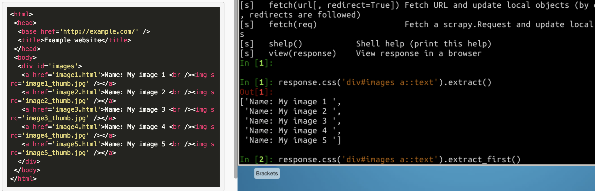
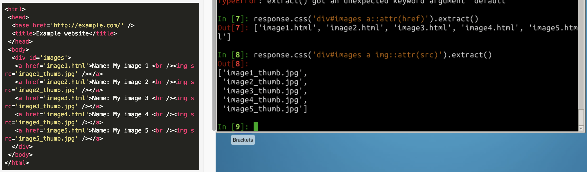
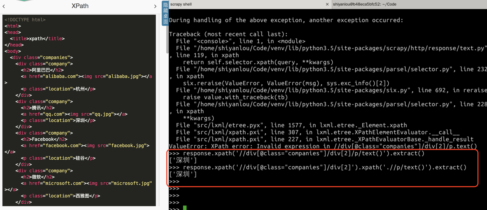
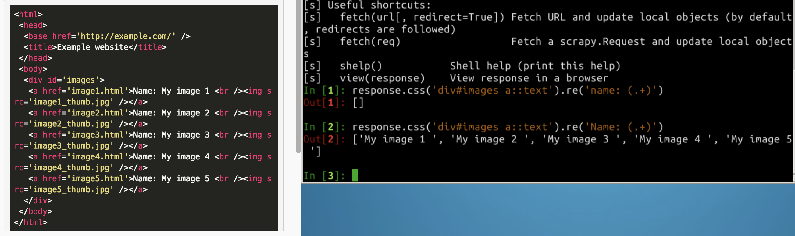
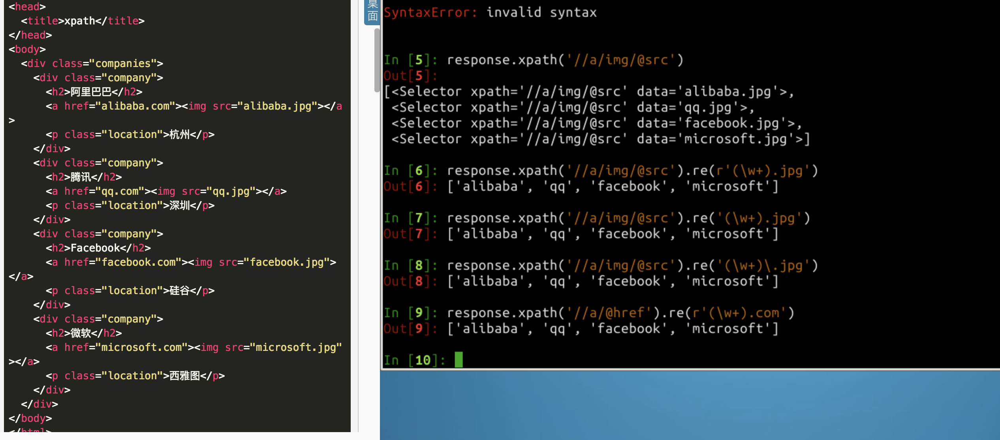

## 简介
Scrapy 是使用 Python 实现的一个开源爬虫框架。秉承着 “Don’t Repeat Yourself” 的原则，Scrapy 提供了一套编写爬虫的基础框架和编写过程中常见问题的一些解决方案。Scrapy 主要拥有下面这些功能和特点：

内置数据提取器（Selector），支持XPath 和 Scrapy 自己的 CSS Selector 语法，并且支持正则表达式，方便从网页提取信息。
交互式的命令行工具，方便测试 Selector 和 debugging 爬虫。
支持将数据导出为 JSON，CSV，XML 格式。
内置了很多拓展和中间件用于处理：
- cookies 和 session
- HTTP 的压缩，认证，缓存
- robots.txt
- 爬虫深度限制
- 可拓展性强，可运行自己编写的特定功能的插件

除了列出的这些，还有很多小功能，比如内置的文件、图片下载器等等。另外，Scrapy 基于 twisted 这个高性能的事件驱动网络引擎框架，也就是说，Scrapy 爬虫拥有很高的性能。

下面的内容我们来实现一个爬取实验楼所有课程信息的爬虫。

知识点
- scrapy 爬虫框架介绍
- scrapy 框架安装
- 数据提取器：CSS 和 XPATH
- scrapy shell
- 正则表达式数据提取
- start_urls

## 数据提取器

在开始编写爬虫前，我们先来学习一下 scrapy 的数据提取器（Selector），因为爬虫的本质就是为了获取数据，所以在编写爬虫的过程中需要编写很多数据提取的代码。

scrapy 内置两种数据提取语法： CSS 和 XPath 。


#### scrapy shell

scrapy shell 提供了一个交互式的 Python 环境方便我们测试和debug 爬虫，使用方法是

> scrapy shell [url]

需要提供一个网页的 url，执行命令后，scrapy 会自动去下载这个 url 对应的网页，将结果封装为 scrapy 内部的一个 response 对象并注入到 python shell 中，在这个 response 对象上，可以直接使用 scrapy 内置的css 和 xpath 数据提取器。

```
scrapy shell http://doc.scrapy.org/en/latest/_static/selectors-sample1.html
```
#### CSS 数据提取器

顾名思义，css selector 就是 css 的语法来定位标签。例如要提取例子网页中 ID 为 images 的 div 下所有 a 标签的文本，使用 css 语法可以这样写：
```
>>> response.css('div#images a::text').extract()
['Name: My image 1 ', 'Name: My image 2 ', 'Name: My image 3 ', 'Name: My image 4 ', 'Name: My image 5 ']
```
div#images 表示 id 为 images 的 div，如果是类名为 images，这里就是 div.images。div a 表示该 div 下所有 a 标签，::text 表示提取文本，extract 函数执行提取操作，返回一个列表。如果只想要列表中第一个 a 标签下的文本，可以使用 extract_first 函数：
```
>>> response.css('div#images a::text').extract_first()
'Name: My image 1 '
extract_first() 方法支持对没有匹配到的元素提供一个默认值：

>>> response.css('div#images p::text').extract_first(default='默认值')
'默认值'
div#images 下面并没有 p 标签，所以会返回提供的默认值。如果不提供 default 值的话会返回 None。
```
如果要提取所有 a 标签的 href 链接，可以这样写：
```
>>> response.css('div#images a::attr(href)').extract()
['image1.html', 'image2.html', 'image3.html', 'image4.html', 'image5.html']
```
不只是 href，任何标签的任意属性都可以用 attr() 提取。基于上面的知识，就能轻松写出提取所有图片的链接地址：
```
>>> response.css('div#images a img::attr(src)').extract()
['image1_thumb.jpg', 'image2_thumb.jpg', 'image3_thumb.jpg', 'image4_thumb.jpg', 'image5_thumb.jpg']
```
如果 div 标签中的 class 属性有多个属性值，用 css 提取器可以写为 div[class="r1 r2 r3"] 或者 div.r1.r2.r3




## XPath
在使用 xpath 前，大家首先要把几个概念弄明白。首先，什么是 节点(node)，以上面的文档为例子，每个标签都是一个节点，比如，
```
<div class="company">
  <h2>腾讯</h2>
    
  <p class="location">深圳</p>
</div>
```
这里最外层的 div 是整个文档的一个子节点，里面包含的公司信息标签都是 div 的子节点，节点标签之间的内容称为这个节点的文本(text)，如 腾讯 是 h2 标签的文本。节点标签内部称为节点的属性(attribute)，如 src 是 img 标签的一个属性，每个标签都可以有 class 属性。每个属性都有一个或多个对应的值（class 属性可以有多个值）。那么爬虫的主要目的其实就是从一个文档中获取需要的文本或者属性的值。

进入 scrapy shell ，由于没有下载链接，我们将 example.html 文档手动构建成 response 对象，然后就可以在 response 对象上直接使用 xpath 方法了：

```
>>> from scrapy.http import HtmlResponse
>>> body = open('example.html').read()
>>> response = HtmlResponse(url='http://example.com', body=body.encode('utf-8'))

```
表达式	| 描述
- | :-: | -:
nodename | 选取此节点的所有子节点。
/ |	从根节点选取。
// | 从匹配选择的当前节点选择文档中的节点，而不考虑它们的位置。
. |	选取当前节点。
.. |	选取当前节点的父节点。

/ 表示从根节点开始选取，比如，你想要选取 title 节点，就需要按标签的阶级关系来定位：
```
>>> response.xpath('/html/head/title').extract()
['<title>xpath</title>']
```
而使用 // 就可以不必管标签在文档中的位置：
```
>>> response.xpath('//title').extract()
['<title>xpath</title>']
```
当选取到的标签不止一个的时候，会返回一个列表，比如我们选取所有公司的名称所在的 h2 标签：
```
>>> response.xpath('//h2').extract()
['<h2>阿里巴巴</h2>', '<h2>腾讯</h2>', '<h2>Facebook</h2>', '<h2>微软</h2>']
```
可以在选择表达式后面加上 text() 来指定只返回文本：
```
>>> response.xpath('//h2/text()').extract()
['阿里巴巴', '腾讯', 'Facebook', '微软']
```
而如果想要选取属性值，在属性名称前面加上 @ 符号就可以了，比如我们选取所有 img 的 src 属性：
```
>>> response.xpath('//img/@src').extract()
['alibaba.jpg', 'qq.jpg', 'facebook.jpg', 'microsoft.jpg']
```
我们同样可以用属性来定位节点，比如我们要选取所有 class 属性值为 location 的 p内的文本：
```
>>> response.xpath('//p[@class="location"]/text()').extract()
['杭州', '深圳', '硅谷', '西雅图']
```
在节点名称后面加上 [n] ，n 是一个数字，这样可以获取到该节点下某个子节点的第 n 个，比如我们要获取 div.companies 下的第二个 div 子 节点，也就是腾讯所在的 div 节点，那么可以这样写：
```
>>> response.xpath('//div[@class="companies"]/div[2]')
[<Selector xpath='//div[@class="companies"]/div[2]' data='<div class="company">\n      <h2>腾讯</h2>\n'>]
```
scrapy 中，对 xpath 方法选取到的对象可以进一步运用 xpath 方法，比如上一步中，我们获取到了腾讯所在的 div 标签，现在我们想在当前结果基础上进一步获取公司的网址，你可能会写出这样的代码：
```
>>> response.xpath('//div[@class="companies"]/div[2]').xpath('//a/@href').extract()
['alibaba.com', 'qq.com', 'facebook.com', 'microsoft.com']
```
这时候你发现返回的其实是所有 a 标签的 href，这是因为 // 是基于整个文档来选择的，如果想要基于当前已经选择了的部分运用 xpath 方法， 则要在 // 前面加上 . 号：
```
>>> response.xpath('//div[@class="companies"]/div[2]').xpath('.//a/@href').extract()
['qq.com']
```


前面我们说到过，一个标签的属性值可以存在多个，比如 <div class=“name1 name2 name3”>hello</div>，这种情况下进行定位的时候，把所有类名都写上就比较麻烦。这时候可以选取一个能唯一代表该 div 的类名，假设我们选了 name2，然后可以使用 contains(@attr, "value") 方法，该方法表示，只要标签的属性包含指定的值就可以：
```
>>> response.xpath('//div[contains(@class, "name2")]/text()').extract()
['hello']
```


## re 和 re_first 方法

除了 extract() 和 extract_first()方法， 还有 re() 和 re_first() 方法可以用于 css() 或者 xpath() 方法返回的对象。

使用 extract() 直接提取的内容可能并不符合格式要求，比如上面的 CSS 提取器例子中，获取的第一个 a 标签的 text 是这样的：Name: My image 1，现在要求不要开头的 Name: 和结尾的空格，这时候就可以使用 re() 替代 extract 方法，使用正则表达式对提取的内容做进一步的处理：
```
>>> response.css('div#images a::text').re('Name: (.+) ')
['My image 1', 'My image 2', 'My image 3', 'My image 4', 'My image 5']
```
re() 方法中定义的正则表达式会作用到每个提取到的文本中，只保留正则表达式中的子模式匹配到的内容，也就是 () 内的匹配内容。

re_first() 方法支持只作用于第一个文本：
```
>>> response.css('div#images a::text').re_first('Name: (.+) ')
'My image 1'
```




## 实战

下面我们使用 scrapy 写一个爬虫，爬取实验楼所有课程名称、简介、类型和学习人数信息，并保存为 JSON 文本。

在 /home/shiyanlou/Code 下新建 shiyanlou_courses_spider.py 文件，写入 scrapy 爬虫的基本结构：
```
# -*- coding:utf-8 -*-
import scrapy

class ShiyanlouCoursesSpider(scrapy.Spider):
    """ 所有 scrapy 爬虫需要写一个 Spider 类，这个类要继承 scrapy.Spider 类。在这个类中定义要请求的网站和链接、如何从返回的网页提取数据等等。
    """

    # 爬虫标识符号，在 scrapy 项目中可能会有多个爬虫，name 用于标识每个爬虫，不能相同
    name = 'shiyanlou-courses'

    def start_requests(self):
        """ 需要返回一个可迭代的对象，迭代的元素是 `scrapy.Request` 对象，可迭代对象可以是一个列表或者迭代器，这样 scrapy 就知道有哪些网页需要爬取了。`scrapy.Request` 接受一个 url 参数和一个 callback 参数，url 指明要爬取的网页，callback 是一个回调函数用于处理返回的网页，通常是一个提取数据的 parse 函数。
        """

    def parse(self, response):
        """ 这个方法作为 `scrapy.Request` 的 callback，在里面编写提取数据的代码。scrapy 中的下载器会下载 `start_reqeusts` 中定义的每个 `Request` 并且将结果封装为一个 response 对象传入这个方法。
        """
        pass
```
分析实验楼的课程页面可以看出，一共有 22 个课程页面，URL 模版是这样的：
```
https://www.shiyanlou.com/courses/?category=all&course_type=all&fee=all&tag=all&page={}
```  

这样就可以写出 start_requests 方法：
```
def start_requests(self):
    # 课程列表页面 url 模版
    url_tmpl = 'https://www.shiyanlou.com/courses/?category=all&course_type=all&fee=all&tag=all&page={}'
    # 所有要爬取的页面
    urls = (url_tmpl.format(i) for i in range(1, 23))
    # 返回一个生成器，生成 Request 对象，生成器是可迭代对象
    for url in urls:
        yield scrapy.Request(url=url, callback=self.parse)
```        
scrapy 内部的下载器会下载每个 Request，然后将结果封装为 response 对象传入 parse 方法，这个对象和前面 scrapy shell 练习中的对象是一样的，也就是说你可以用 response.css() 或者 response.xpath() 来提取数据了。

通过分析实验楼课程页面的文档结构，以《Python 数据分析入门与进阶》课程为例，我们需要提取的数据主要包含在下面的 div 里面：
```
<div class="course-body">
    <div class="course-name">Python 数据分析入门与进阶</div>
            <div class="course-desc">在本训练营中，我们将学习怎么样使用 Python 进行数据分析。课程将从数据分析基础开始，一步步深入讲解。从 Python 的基础用法到数据分析的各种算法，并结合各种实例，讲解数据分析过程中的方方面面。</div>
            <div class="course-footer">
                <span class="course-per-num pull-left">
                    <i class="fa fa-users"></i>

                    133

                </span>

             <span class="course-bootcamp pull-right">训练营</span>        
      </div>
</div>
```
根据这个 div 可以用提取器写出 parse 方法：
```
def parse(self, response):
    # 遍历每个课程的 div.course-body
    for course in response.css('div.course-body'):
        # 使用 css 语法对每个 course 提取数据
        yield {
            # 课程名称
            'name': course.css('div.course-name::text').extract_first(),
            # 课程描述
            'description': course.css('div.course-desc::text').extract_first(),
            # 课程类型，实验楼的课程有免费，会员，训练营三种，免费课程并没有字样显示，也就是说没有 span.pull-right 这个标签，没有这个标签就代表是免费课程，使用默认值 `免费｀就可以了。
            'type': course.css('div.course-footer span.pull-right::text').extract_first(default='Free'),
            # 注意 // 前面的 .，没有点表示整个文档所有的 div.course-body，有 . 才表示当前迭代的这个 div.course-body
               'students': course.xpath('.//span[contains(@class, "pull-left")]/text()[2]').re_first('[^\d]*(\d+)[^\d]*')
        }
```        
students 提取的课程学习人数，提取代码为什么要这样写，有几点需要注意一下。首先，我们要提取的数据在下面这个结构中：
```

<span class="course-per-num pull-left">
                    <i class="fa fa-users"></i>

                    133

                </span>
```                
这个结构的文本包含了很多空白和换行，如果是以下面的 xpath 提取的话：
```
course.xpath('.//span[contains(@class, "pull-left")]/text()').extract()

结果是这样的，有俩个文本内容，第一个是<span>和 <i>之间的文本，第二个是 </i>和 </span>之间的文本：

['\n                \t', '\n\t                \n            \t    151455\n                \t\n\t\t\t\t']

text()[2]表示取第二个文本，re_first('[^\d]*(\d+)[^\d]*')表示只需要文本中的数字。
```
按照上一步中的格式写好 spider 后，就能使用 scrapy 的 runspider 命令来运行爬虫了。

scrapy runspider shiyanlou_courses_spider.py -o data.json
注意这里输出得到的 data.json 文件中的中文显示成 unicode 编码的形式，所以看到感觉像是乱码，其实是正常的。

-o 参数表示打开一个文件，scrapy 默认会将结果序列化为 JSON 格式写入其中。爬虫运行完后，在当前目录打开 data.json 文件就能看到爬取到的数据了。


scrapy.Spider 类已经有了一个默认的 start_requests方法，我们的爬虫代码其实可以进一步简化，只提供需要爬取的 start_urls，默认的 start_requests 方法会根据 start_urls 生成 Request 对象。所以，代码可以修改为：
```
import scrapy


class ShiyanlouCoursesSpider(scrapy.Spider):

    name = 'shiyanlou-courses'

    @property
    def start_urls(self):
        """ start_urls  需要返回一个可迭代对象，所以，你可以把它写成一个列表、元组或者生成器，这里用的是生成器
        """
        url_tmpl = 'https://www.shiyanlou.com/courses/?category=all&course_type=all&fee=all&tag=all&page={}'
        return (url_tmpl.format(i) for i in range(1, 23))

    def parse(self, response):
        for course in response.css('div.course-body'):
            yield {
                'name': course.css('div.course-name::text').extract_first(),
                'description': course.css('div.course-desc::text').extract_first(),
                'type': course.css('div.course-footer span.pull-right::text').extract_first(),
                'students': course.xpath('.//span[contains(@class, "pull-left")]/text()[2]').re_first('[^\d]*(\d+)[^\d]*')
            }
```
