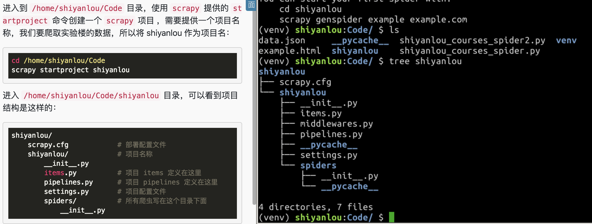
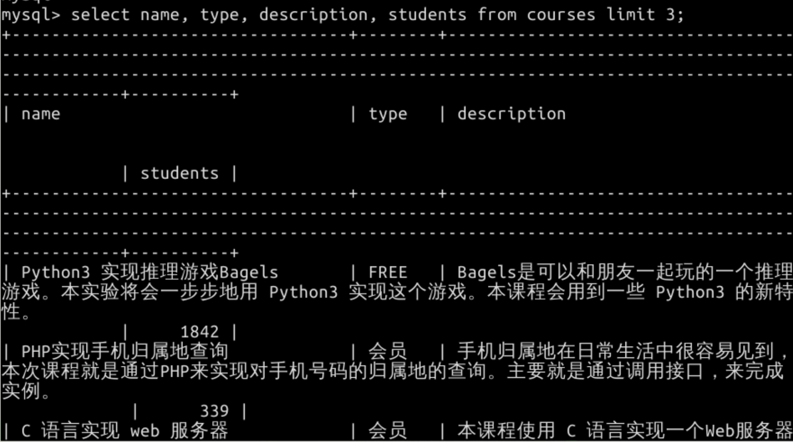
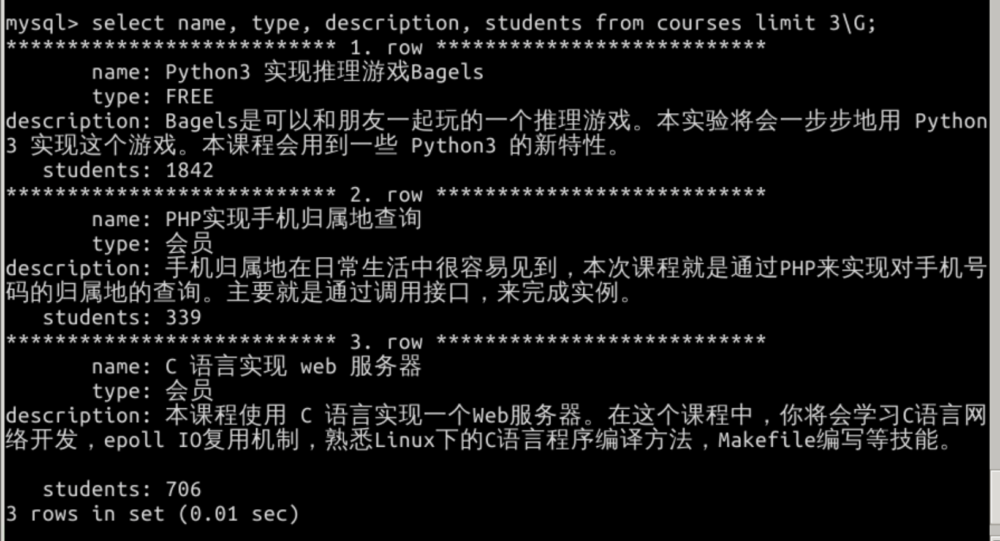

#### 知识点
- 连接数据库
- 创建 Scrapy 项目
- 创建爬虫
- Item 容器
- Item Pipeline
- Models 创建表
- 保存 Item 到数据库
- Item 过滤

## 创建项目

```
cd /home/shiyanlou/Code
scrapy startproject shiyanlou
```




##  创建爬虫

scrapy 的 genspider 命令可以快速初始化一个爬虫模版，使用方法如下：

scrapy genspider <name> <domain>
name 这个爬虫的名称，domain 指定要爬取的网站。

进入第二个 shiyanlou 目录，运行下面的命令快速初始化一个爬虫模版：
```
cd /home/shiyanlou/Code/shiyanlou/shiyanlou
scrapy genspider courses shiyanlou.com
scrapy 会在 /home/shiyanlou/Code/shiyanlou/shiyanlou/spiders 目录下新建一个 courses.py 的文件，并且在文件中为我们初始化了代码结构：

# -*- coding: utf-8 -*-
import scrapy

class CoursesSpider(scrapy.Spider):
    name = 'courses'
    allowed_domains = ['shiyanlou.com']
    start_urls = ['http://shiyanlou.com/']

    def parse(self, response):
        pass

```        
这里面有一个新的属性 allowed_domains 是在前一节中没有介绍到的。它是干嘛的呢？allow_domains 可以是一个列表或字符串，包含这个爬虫可以爬取的域名。假设我们要爬的页面是 https://www.example.com/1.hml, 那么就把example.com 添加到 allowed_domains。这个属性是可选的，在我们的项目中并不需要使用它，所以可以删除。

除此之外 start_urls 的代码和上一节相同：
```
# -*- coding: utf-8 -*-
import scrapy


class CoursesSpider(scrapy.Spider):
    name = 'courses'

    @property
    def start_urls(self):
        url_tmpl = 'https://www.shiyanlou.com/courses/?category=all&course_type=all&fee=all&tag=all&page={}'
        return (url_tmpl.format(i) for i in range(1, 23))


```

## Item

爬虫的主要目标是从网页中提取结构化的信息，scrapy 爬虫可以将爬取到的数据作为一个 Python dict 返回，但由于 dict 的无序性，所以它不太适合存放结构性数据。scrapy 推荐使用 Item 容器来存放爬取到的数据。

所有的 items 写在 items.py（/home/shiyanlou/Code/shiyanlou/shiyanlou/items.py） 中，下面为要爬取的课程定义一个 Item：
```
import scrapy


class CourseItem(scrapy.Item):
      """定义 Item 非常简单，只需要继承 scrapy.Item 类，将每个要爬取
    的数据声明为 scrapy.Field()。下面的代码是我们每个课程要爬取的 4个数据。
    """
    name = scrapy.Field()
    description = scrapy.Field()
    type = scrapy.Field()
    students = scrapy.Field()
有了 CourseItem，就可以将 parse 方法的返回包装成它：

# -*- coding: utf-8 -*-
import scrapy
from shiyanlou.items import CourseItem


class CoursesSpider(scrapy.Spider):
    name = 'courses'

    @property
    def start_urls(self):
        url_tmpl = 'https://www.shiyanlou.com/courses/?category=all&course_type=all&fee=all&tag=all&page={}'
        return (url_tmpl.format(i) for i in range(1, 23))

    def parse(self, response):
        for course in response.css('div.course-body'):
            # 将返回结果包装为 CourseItem 其它地方同上一节
            item = CourseItem({
                'name': course.css('div.course-name::text').extract_first(),
                'description': course.css('div.course-desc::text').extract_first(),
                'type': course.css('div.course-footer span.pull-right::text').extract_first(default='免费'),
                'students': course.xpath('.//span[contains(@class, "pull-left")]/text()[2]').re_first('[^\d]*(\d*)[^\d]*')
            })
            yield item

```

## 创建 Model, 表

在 items.py 所在目录下创建 models.py（/home/shiyanlou/Code/shiyanlou/shiyanlou/models.py），在里面使用 sqlalchemy 语法定义 courses 表结构：
```
from sqlalchemy import create_engine
from sqlalchemy.ext.declarative import declarative_base
from sqlalchemy import Column, String, Integer


engine = create_engine('mysql+mysqldb://root@localhost:3306/shiyanlou?charset=utf8')
Base = declarative_base()

class Course(Base):
    __tablename__ = 'courses'

    id = Column(Integer, primary_key=True)
    name = Column(String(64), index=True)
    description = Column(String(1024))
    type = Column(String(64), index=True)
    students = Column(Integer)

if __name__ == '__main__':
    Base.metadata.create_all(engine)
```    
运行程序：

> python3 models.py

如果运行正确的话，程序什么都不会输出，执行完后，进去 MySQL 中检查是否已经创建了表：
```
mysql > use shiyanlou;
mysql> show tables;
+---------------------+
| Tables_in_shiyanlou |
+---------------------+
| courses             |
+---------------------+
```
如果出现类似上面的东西说明表已经创建成功了！


## Item Pipeline

如果把 scrapy 想象成一个产品线，spider 负责从网页上爬取数据，Item 相当于一个包装盒，对爬取的数据进行标准化包装，然后把他们扔到Pipeline 流水线中。

主要在 Pipeline 对 Item 进行这几项处理：

验证爬取到的数据 (检查 item 是否有特定的 field)
检查数据是否重复
存储到数据库
当创建项目时，scrapy 已经在 /home/shiyanlou/Code/shiyanlou/shiyanlou/pipelines.py 中为项目生成了一个 pipline模版：
```
class ShiyanlouPipeline(object):
    def process_item(self, item, spider):
        """ parse 出来的 item 会被传入这里，这里编写的处理代码会
        作用到每一个 item 上面。这个方法必须要返回一个 item 对象。
        """
        return item
除了 process_item 还有俩个常用的 hooks 方法，open_spider 和 close_spider：

class ShiyanlouPipeline(object):
    def process_item(self, item, spider):
        return item

    def open_spider(self, spider):
        """ 当爬虫被开启的时候调用
        """
        pass

    def close_spider(self, spider):
        """ 当爬虫被关闭的时候调用
        """
        pass        
```

## 保存item 到数据库

创建好数据表后，就可以在 pipeline 编写代码将 爬取到的每个 item 存入数据库中。
```
from sqlalchemy.orm import sessionmaker
from shiyanlou.models import Course, engine


class ShiyanlouPipeline(object):

    def process_item(self, item, spider):
        # 提取的学习人数是字符串，把它转换成 int
        item['students'] = int(item['students'])
        # 根据 item 创建 Course Model 对象并添加到 session
        # item 可以当成字典来用，所以也可以使用字典解构, 相当于
        # Course(
        #     name=item['name'],
        #     type=item['type'],
        #     ...,
        # )
        self.session.add(Course(**item))
        return item

    def open_spider(self, spider):
        """ 在爬虫被开启的时候，创建数据库 session
        """
        Session = sessionmaker(bind=engine)
        self.session = Session()

    def close_spider(self, spider):
        """ 爬虫关闭后，提交 session 然后关闭 session
        """
        self.session.commit()
        self.session.close()
```
我们编写的这个 ShiyanlouPipeline 默认是关闭的状态，要开启它，需要在 /home/shiyanlou/Code/shiyanlou/shiyanlou/settings.py 将下面的代码取消注释：

\# 默认是被注释的
ITEM_PIPELINES = {
    'shiyanlou.pipelines.ShiyanlouPipeline': 300
}
ITEM_PIPELINES 里面配置需要开启的 pipeline，它是一个字典，key 表示 pipeline 的位置，值是一个数字，表示的是当开启多个 pipeline 时它的执行顺序，值小的先执行，这个值通常设在 100~1000 之间。


## 运行

前面使用的 runspider 命令用于启动一个独立的 scrapy 爬虫脚本，在 scrapy 项目中启动爬虫使用 crawl 命令，需要指定爬虫的 name：
```
cd /home/shiyanlou/Code/shiyanlou/shiyanlou
scrapy crawl courses
```
爬虫运行完后，进入 MySQL，输入下面的命令查看爬取数据的前 3 个：
```
mysql> use shiyanlou;
mysql> select name, type, description, students from courses limit 3\G;
```
因为 scrapy 爬虫是异步执行的，所以爬取到的 course 顺序和实验楼网站上的会不一样。

---
\G : 在Mysql的命令行工具里面给select查询加入一个\G参数。横向的表结构会转为使用纵向表结构输出，利于阅读。

http://blog.sina.com.cn/s/blog_606dc26a0100g8tq.html




---

本节涉及到的知识点如下：

- 连接数据库
- 创建 Scrapy 项目
- 创建爬虫
- Item 容器
- Item Pipeline
- Models 创建表
- 保存 Item 到数据库
- Item 过滤
