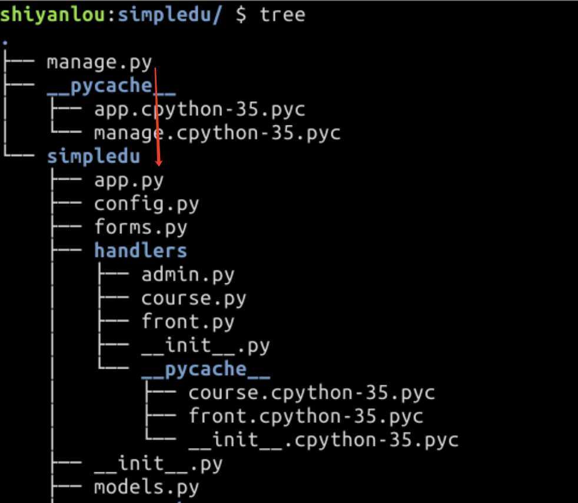
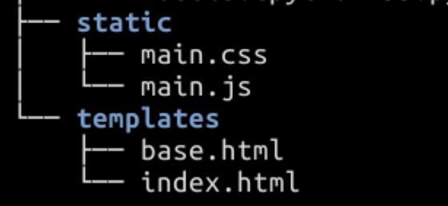
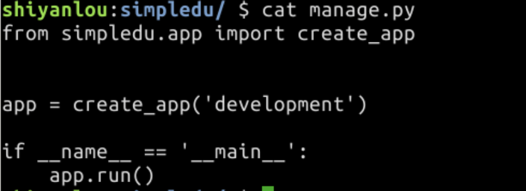
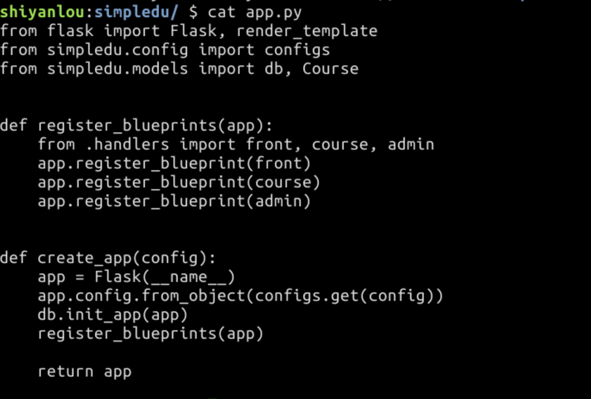
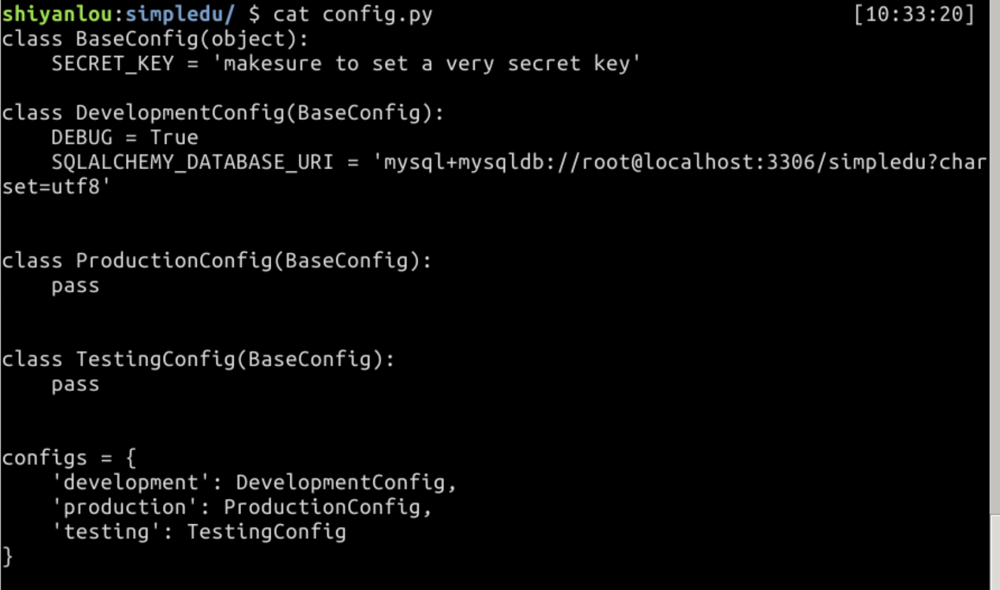
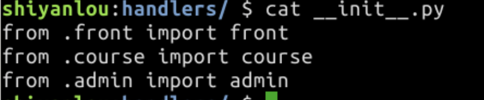
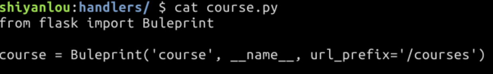
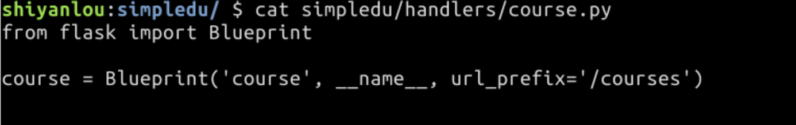
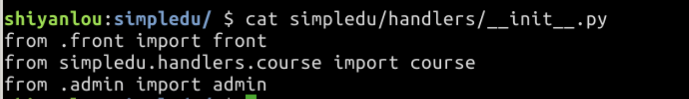

# 20.在线教育网站一中型项目开发框架搭建

##目录

<!-- TOC depthFrom:1 depthTo:6 withLinks:1 updateOnSave:1 orderedList:0 -->

- [20.在线教育网站一中型项目开发框架搭建](#20在线教育网站一中型项目开发框架搭建)
	- [目录](#目录)
	- [导读](#导读)
		- [知识点](#知识点)
	- [环境准备](#环境准备)
	- [一个简单的例子](#一个简单的例子)
	- [后端模块化](#后端模块化)
- [注意这里不再传入 app 了](#注意这里不再传入-app-了)
- [使用开发环境配置](#使用开发环境配置)
	- [页面模块化](#页面模块化)
	- [Buleprint(蓝图)](#buleprint蓝图)
- [省略了 url_prefix，那么默认就是 '/'](#省略了-urlprefix那么默认就是-)
- [省略了 url_prifix，那么默认就是 '/'](#省略了-urlprifix那么默认就是-)
- [注意路由和函数名的变化](#注意路由和函数名的变化)

<!-- /TOC -->

## 导读

从这一节开始，我们来实现这个视频在线教育网站。从学习楼＋开始到现在，我们创建的有限的 Flask App，核心代码基本都是写在一个 app.py 的文件中，最多加上templates 模板文件夹和 static 静态文件文件夹。对于一个小型的项目，这样的结构勉强可以应付，但显然不适合中大型的项目。本节的主要目标就是搭建一个适合中大型项目开发的 Flask 项目结构。

项目从小到大，最重要的就是要做到模块化，根据代码的功能将代码划分为多个文件。安装功能划分后，如果每个文件还是太大，就可以把每个文件再拆分成多个文件然后放在一个目录下。这个思想贯穿几天要讲的后端代码模块化。

页面模块化主要是利用 Jinja2 的 block 语法将网页划分为多个不同的功能区块。利用 block 可以继承的特性，建立页面之间的继承关系。这样可以使我们的网页结构更为清晰同时也能避免重复代码，减少代码量。

### 知识点
- Flask Web 框架
- 后端模块化
- 前端模块化
- Blueprint
- Bootstrap

## 环境准备

- 首先在/home/shiyanlou下创建一个目录 simpledu ，这是我们项目的名称，也是我们编写代码的主目录。
```
mkdir /home/shiyanlou/simpledu
```
- 安装 flask 和 flask-sqlalchemy 这两个 Flask 开发基础包，以及连接 MySQL 数据库需要用到的 mysqlclient 包：
```
sudo pip3 install flask flask-sqlalchemy mysqlclient
```
- 修改 /etc/mysql/my.cnf，将 mysql 编码设置为 utf8：
```
[client]
default-character-set = utf8

[mysqld]
character-set-server = utf8

[mysql]
default-character-set = utf8
```
- 启动并进入 MySQL 数据库：
```
$ sudo service mysql start
$ mysql -uroot
```
- 创建 simpledu 数据库待用：
```
mysql> create database simpledu;
```

## 一个简单的例子

在 simpledu 下创建 app.py，templates/index.html ，static/main.js 以及 static/main.css 目录和文件。

```python
from datetime import datetime
from flask import Flask, render_template
from flask_sqlalchemy import SQLAlchemy

app = Flask(__name__)

app.config.update(dict(
   SECRET_KEY = 'very secret key',
   SQLALCHEMY_DATABASE_URI='mysql+mysqldb://root@localhost:3306/simpledu?charset=utf8'
))

db = SQLAlchemy(app)

class User(db.Model):
    __tablename__ = 'user'

    id = db.Column(db.Integer, primary_key=True)
    username = db.Column(db.String(32), unique=True, index=True, nullable=False)
    publish_courses = db.relationship('Course')
    created_at = db.Column(db.DateTime, default=datetime.utcnow)
    updated_at = db.Column(db.DateTime, default=datetime.utcnow, onupdate=datetime.utcnow)

class Course(db.Model):
    __tablename__ = 'course'

    id = db.Column(db.Integer, primary_key=True)
    name = db.Column(db.String(128), unique=True, index=True, nullable=False)
    # ondelete='CASCADE' 表示如果用户被删除了，那么作者为他的
    # 课程也会被及联删除
    author_id = db.Column(db.Integer, db.ForeignKey('user.id', ondelete='CASCADE'))
    author= db.relationship('User', uselist=False)
    created_at = db.Column(db.DateTime, default=datetime.utcnow)
    updated_at = db.Column(db.DateTime, default=datetime.utcnow, onupdate=datetime.utcnow)

@app.route('/')
def index():
    courses = Course.query.all()
    return render_template('index.html', courses=courses)

@app.route('/admin')
def admin_index():
    return 'admin'

if __name__ == '__main__':
    app.run()
```

配置环境变量：
```
export FLASK_APP=app.py
export FLASK_DEBUG=1
```
运行
```
flask shell
```
进入 flask shell，创建几条测试数据：
```
>>> from app import db, User, Course
>>> db.create_all()
>>> user = User(username='admin')
>>> course1 = Course(name='python course', author=user)
>>> course2 = Course(name='flask course', author=user)
>>> db.session.add(user)
>>> db.session.add(course1)
>>> db.session.add(course2)
>>> db.session.commit()
```
退出 flask shell，编辑 index.html ，使用 jinja2 语法简单的渲染一下课程列表：
```
<!DOCTYPE html>
<html lang="zh-CN">
    <head>
        <meta charset="UTF-8" />
        <title>Index</title>
        <link rel="stylesheet" href="static/main.css">
    </head>
    <body>
        
          <p>{{ course.name }} - {{ course.author.username }}</p>
        
    </body>
    <script src="static/main.js"></script>
</html>
```
在 static/main.js 中写入一个简单的 js：

```
alert('Hello, Simpledu!')
```
在 static/main.css 中写入一个简单的 css：
```
body {
  background-color: red;
}
```
运行 app：
```
flask run
```
现在访问 localhost:5000 就能看到下面的页面了。

## 后端模块化

首先我们需要一个目录存放后端代码，这个目录通常与主目录同名，所以在 /home/shiyanlou/simpledu 下再创建一个 simpledu，在这个 simpledu 下创建下面几个文件：
```
simpledu/
    __init__.py  # 每个 Python 包都需要创建的文件
    config.py    # 存放配置, 待用
    models.py    # 存放数据模型相关代码, 待用
    forms.py     # 存放表单相关代码, 待用
    app.py       # Flask App 配置，创建相关代码
```    
现在可以把原来 app.py 中的代码按功能拆分到我们创建的这几个文件中了。

首先是配置文件 config.py ，在实际的开发中，开发，测试，部署往往需要不同的配置，这就需要一种机制来完成这种需求。 Flask 支持从一个 Python 类中读取配置，这样我们可以用不同的类对应不同的场景，将共同的配置放在一个基类中。

```python
class BaseConfig(object):
    """ 配置基类 """
    SECRET_KEY = 'makesure to set a very secret key'

class DevelopmentConfig(BaseConfig):
    """ 开发环境配置 """
    DEBUG = True
    SQLALCHEMY_DATABASE_URI = 'mysql+mysqldb://root@localhost:3306/simpledu?charset=utf8'


class ProductionConfig(BaseConfig):
    """ 生产环境配置 """
    pass


class TestingConfig(BaseConfig):
    """ 测试环境配置 """
    pass


configs = {
    'development': DevelopmentConfig,
    'production': ProductionConfig,
    'testing': TestingConfig
}
```

然后将数据模型相关代码移入 models.py 中：
```python
from datetime import datetime
from flask_sqlalchemy import SQLAlchemy

# 注意这里不再传入 app 了
db = SQLAlchemy()

class User(db.Model):
    __tablename__ = 'user'

    id = db.Column(db.Integer, primary_key=True)
    username = db.Column(db.String(32), unique=True, index=True, nullable=False)
    publish_courses = db.relationship('Course')
    created_at = db.Column(db.DateTime, default=datetime.utcnow)
    updated_at = db.Column(db.DateTime, default=datetime.utcnow, onupdate=datetime.utcnow)

class Course(db.Model):
    __tablename__ = 'course'

    id = db.Column(db.Integer, primary_key=True)
    name = db.Column(db.String(128), unique=True, index=True, nullable=False)
    author_id = db.Column(db.Integer, db.ForeignKey('user.id', ondelete='CASCADE'))
    author= db.relationship('User', uselist=False)
    created_at = db.Column(db.DateTime, default=datetime.utcnow)
    updated_at = db.Column(db.DateTime, default=datetime.utcnow, onupdate=datetime.utcnow)
```
因为要根据配置来动态的创建 Flask app，官方推荐的做法是使用一个工厂函数专门负责创建 app。在新创建的 app.py 中创建一个工厂函数 create_app，用于生成 Flask App 对象，并暂时将两个路由函数移入其中：
```python
from flask import Flask, render_template
from simpledu.config import configs
from simpledu.models import db, Course


def create_app(config):
    """ 可以根据传入的 config 名称，加载不同的配置
    """
    app = Flask(__name__)
    app.config.from_object(configs.get(config))
    # SQLAlchemy 的初始化方式改为使用 init_app
    db.init_app(app)

    # 路由函数暂时写在这里，后面会介绍使用 Flask 的 Blueprint 实现
    # 路由的模块化
    @app.route('/')
    def index():
        courses = Course.query.all()
        return render_template('index.html', courses=courses)

    @app.route('/admin')
    def admin_index():
        return 'admin'

    return app
```    
删除主目录下的 app.py ，创建 manage.py，在里面使用工厂函数创建 app 并启动：
```
from simpledu.app import create_app

# 使用开发环境配置
app = create_app('development')

if __name__ == '__main__':
  app.run()
```  
将 static 和 templates 目录移入 simpledu/simpledu，然后重新设置环境变量：
```
mv templates simpledu/
mv static simpledu/
export FLASK_APP=manage.py
```
运行 flask run 重新启动应用，访问 localhost:5000 可以看到和之前是一样的结果。

## 页面模块化


在 templates 中 新建 base.html，作为所有模板文件的基模板，使用 block 语法创建几个基本的 block：
```
<!DOCTYPE html>
<html lang="zh-CN">
    <head>
        <meta charset="UTF-8">
        <title></title>
        <link rel="stylesheet" href="static/main.css">
    </head>
    <body>
      
      
      <script src="static/main.js"></script>
    </body>    
</html>
```
上面创建了 title 、body 和 footer 3 个 block，这样就可以将 index.html 改为继承 base.html：
```


Home


  
    <p>{{ course.name }} - {{ course.author.username }}</p>
  

```
现在再访问 localhost:5000，可以看到还是和以前一样的结果。

## Buleprint(蓝图)

Blueprint 是 Flask 提供的将应用组件化的一种机制。对一个中大型网站来说，有很多个板块，就拿实验楼网站来说，主要的板块有：
```
shiyanlou.com/         # 主板块，about,login,register 等页面都在该板块下
shiyanlou.com/courses  # 课程板块
shiyanlou.com/bootcamp # 训练营板块
shiyanlou.com/louplus  # 楼+板块
```
每个板块下面都会有多个页面。我们知道，Flask 要实例化一个 app 管理 Flask 应用，而 Blueprint 可以让你将板块注册为 app 下的一个子 app。这个子 app，也就是我们注册的蓝图，它的使用方法基本上和 app 一样的。

比如，我们注册一个课程板块的蓝图：
```
from flask import Blueprint

course = Blueprint('course', __name__, url_prefix='/courses')
```
然后调用 app 的 **register_blueprint** 将这个 course Blueprint 注册到 app：

 >app.register_blueprint(course)

这样在注册路由时，比如实验楼课程首页的路由就可以这样写：
```
@course.route('/')
def courses_index():
    return render_template('courses.html')

```    

应用启动后，访问 shiyanlou.com/courses 就可以看到 courses.html 页面。

回到我们的 simpledu 应用，我们定义下面三个蓝图
```
localhost:5000/         # front 蓝图，负责首页，注册，登录等页面
localhost:5000/courses  # course 蓝图，负责课程相关页面
localhost:5000/admin    # admin 蓝图，负责后台管理相关页面
```
首先在 simpledu/simpledu 下创建一个 handlers 用于存放蓝图，在里面创建蓝图文件和 __init__.py：
```
handlers/
  __init__.py
  front.py
  course.py
  admin.py
```  
分别在上面的三个蓝图文件中创建相应的蓝图。在 front.py 中：
```
from flask import Blueprint

# 省略了 url_prefix，那么默认就是 '/'
front = Blueprint('front', __name__)
```
在 course.py 中：
```
from flask import Blueprint

course = Blueprint('course', __name__, url_prefix='/courses')
```
在 admin.py 中：
```
from flask import Blueprint

admin = Blueprint('admin', __name__, url_prefix='/admin')
```
然后在 __init__.py 中引入这些蓝图：
```
from .front import front
from .course import course
from .admin import admin
```
在 app.py 中创建一个用于注册蓝图的函数：
```
def register_blueprints(app):
    from .handlers import front, course, admin
    app.register_blueprint(front)
    app.register_blueprint(course)
    app.register_blueprint(admin)
```    
现在可以在 create_app 中调用蓝图注册函数，注册蓝图，同时把前面实现的两个路由函数移到相应的蓝图中：
```
def create_app(config):
    """ App 工厂"""
    app = Flask(__name__)
    app.config.from_object(configs.get(config))
    db.init_app(app)
    register_blueprints(app)
    return app
```
将 index 路由移入 front.py 中：
```
from flask import Blueprint, render_template
from simpledu.models import Course

# 省略了 url_prifix，那么默认就是 '/'
front = Blueprint('front', __name__)

@front.route('/')
def index():
    courses = Course.query.all()
    return render_template('index.html', courses=courses)
```
将 admin_index 移入admin.py 中：
```
from flask import Blueprint

admin = Blueprint('admin', __name__, url_prefix='/admin')

# 注意路由和函数名的变化
@admin.route('/')
def index():
    return 'admin'
```    
现在重新启动应用，访问 localhost:5000，还是和之前一样的结果。

## 引入 Bootstrap

有了模板继承系统，我们就不需要为所有页面引入 bootstap 相关文件了，只需要在 base.html 引入，下面在 base.html 中引入 bootstrap 相关的 CDN 文件：
```
<!DOCTYPE html>
<html lang="zh-CN">
    <head>
        <meta charset="UTF-8">
        <title></title>
        <link rel="stylesheet" href="https://cdn.bootcss.com/bootstrap/3.3.7/css/bootstrap.min.css">
        <link rel="stylesheet" href="static/main.css">
    </head>
    <body>
      
      
      <!-- Bootstrap 依赖 jQuery -->
      <script src="https://cdnjs.cloudflare.com/ajax/libs/jquery/3.2.1/jquery.min.js"></script>
      <script src="https://cdn.bootcss.com/bootstrap/3.3.7/js/bootstrap.min.js"></script>
      <script src="static/main.js"></script>
    </body>    
</html>
```
现在可以将 main.css 和 main.js 代码删除，在 index.hmtl 中将

标签改为 <h1> 标签：
```
<h1>{{ course.name }} - {{ course.author.username }}</h1>
在 base.html 中将 body、footer block 放入 Bootstrap 的 container 中：

<div class="container">
  
  
</div>
```
修改后的 base.html 文件：
```
<!DOCTYPE html>
<html lang="zh-CN">
    <head>
        <meta charset="UTF-8">
        <title></title>
        <link rel="stylesheet" href="https://cdn.bootcss.com/bootstrap/3.3.7/css/bootstrap.min.css">
    </head>
    <body>
      <div class="container">
        
        
      </div>
      <!-- Bootstrap 依赖 jQuery -->
      <script src="https://cdnjs.cloudflare.com/ajax/libs/jquery/3.2.1/jquery.min.js"></script>
      <script src="https://cdn.bootcss.com/bootstrap/3.3.7/js/bootstrap.min.js"></script>
    </body>    
</html>

```

现在访问 localhost:5000 ，看到样式变成下面这样就说明 Bootstrap 引入成功了。


## 完整代码
本节实验中提供了完整的示例代码，仅供参考，请仍然按照实验步骤逐步实现才会有收获：

# 下载代码文件并解压
$ wget http://labfile.oss.aliyuncs.com/courses/923/week7/code/lab1.zip


---
## 个人梳理:

shiyanlou:simpledu/ $ flask run                                      [10:11:03]

  File "/home/shiyanlou/simpledu/manage.py", line 4, in <module>
    app = create_app('development')
  File "/home/shiyanlou/simpledu/simpledu/app.py", line 17, in create_app
    register_blueprints(app)
  File "/home/shiyanlou/simpledu/simpledu/app.py", line 7, in register_blueprints
    from .handlers import front, course, admin
  File "/home/shiyanlou/simpledu/simpledu/handlers/__init__.py", line 2, in <module>
    from .course import course
  File "/home/shiyanlou/simpledu/simpledu/handlers/course.py", line 1, in <module>
    from flask import Buleprint
ImportError: cannot import name 'Buleprint'










app.config.from_object(configd.get(config))
db.init_app(app)




这里写错了


经测试，是导入路径的写法问题：


- 相对路径
**\.** 表示当前目录，在handlers包中引用，在app中引用handlers包（**\.** 同理），将指向初始化函数（**\__init__** ）

- 绝对路径（manage同目录下包路径）：
simpledu\.handlers.course


引申：
1. handlers 作为一个包，初始化函数被引入。在初始化函数中引入3个蓝图

**from . import 表示从当前文件的路径(.)导入所有()**

**import和from .xxx import \*的一点重要区别**:

- import zzz 不会导入zzz中已导入的模块
- from .xxx import * 会导入xxx中已导入的模块

特别注意：
使用logging时,X 模块导入了log.py，y模块导入了log.py，如果此时在x中有from y import \*，则x中打印日志会重复出现2条，原因是y中也加载了log.py的配置，导致出现重复日志

2. 导入自定义模块


https://blog.csdn.net/jingbo18/article/details/78535821#1289-1509503838014


python import自定义模块方法
http://www.cnitblog.com/seeyeah/archive/2009/03/15/55440.html
