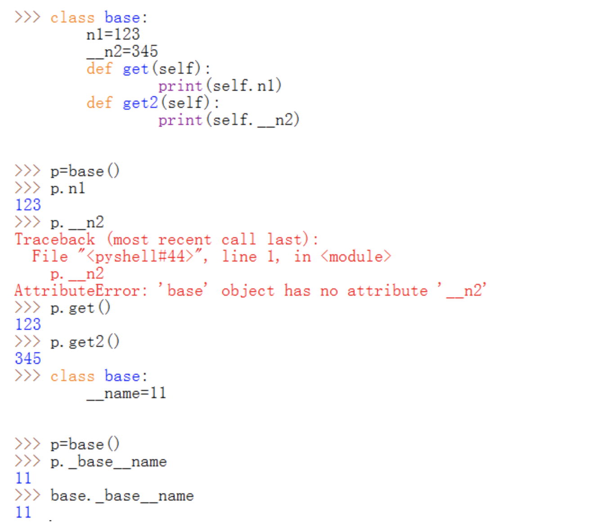
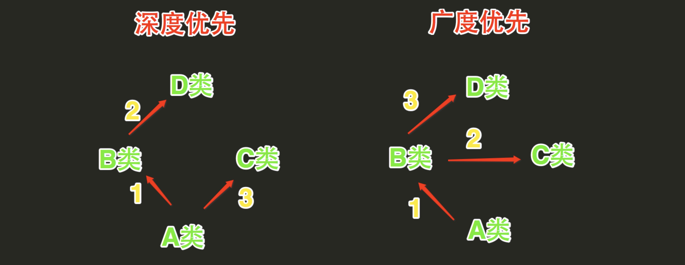
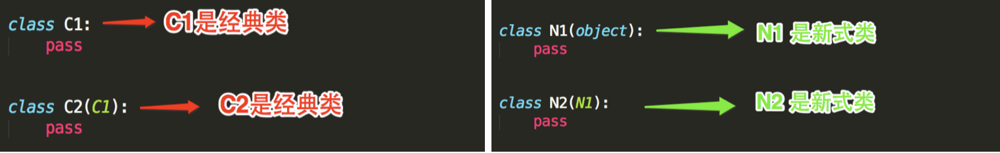
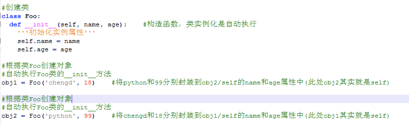
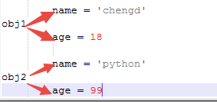
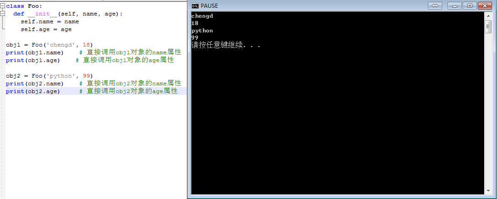
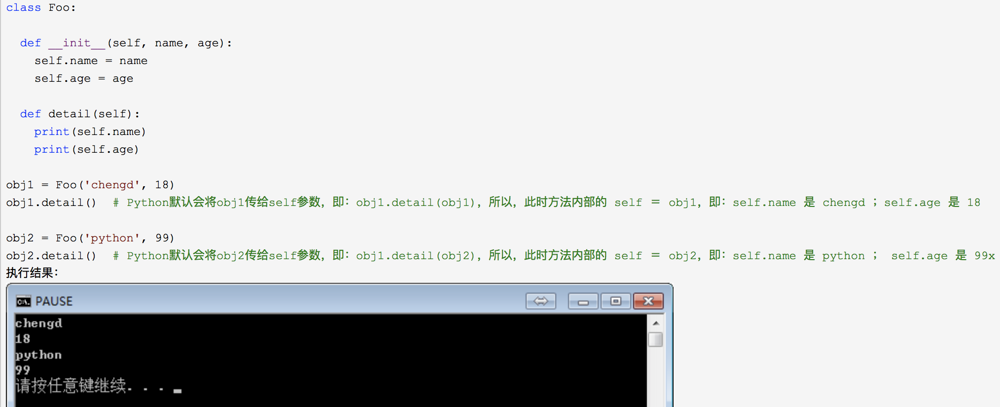

面向对象编程（Object Oriented Programming，简称 OOP，面向对象程序设计）是一种程序设计思想。用面向过程的思想设计程序时，程序是一条条指令的顺序执行，当指令变得多起来时，它们可以被分隔成我们先前实验中讲解过的函数。而面向对象编程则是将对象视为程序的组成单元，程序的执行通过调用对象提供的接口完成。

面向对象的概念不容易通过理论讲解来理解，后续项目实战中我们会大量用到面向对象的思想，本节内容为后续实战做一定的铺垫，不会涉及太深入的内容。

面向对象的 4 个核心概念：

- 抽象
- 封装
- 继承
- 多态
下面我们通过例子和代码来理解这四个概念以及如何在 Python 中运用它们。

---
#### 从面向过程说起

有一条叫旺财的狗和一只叫 Kitty 的猫在叫， 旺财发出 wang wang wang... 的叫声， Kitty 发出 miu miu miu... 的叫声。
如果要把这句话转化为程序语言，使用面向过程的方法，可能会写出下面的代码，注意这部分示例不可以执行，只是讲解面向过程的编程方法：

```
main() {
    dog_name = '旺财';
    dog_sound = 'wang wang wang...';
    cat_name = 'Kitty';
    cat_sound = 'miu miu miu...';
    print(dag_name + ' is making sound ' + dog_sound);
    print(cat_name + ' is making sound ' + cat_sound);
}

执行结果会是：

旺财 is making sound wang wang wang...
Kitty is making sound miu miu miu...
这基本上就是面向过程的代码风格。

```

#### 抽象

以面向对象的思想来写上面的程序。在上面的程序中，“旺财”是狗的一种，它有一个名字，它可以“wang wang wang…” 的叫，我们可以抽象出这样一种类型，狗：
```
dog {
  name   (特征)
  sound() (行为)
}
同理，对于 Kitty，可以抽象为猫，猫也有名字，不过它的行为（叫声）和狗不同：

cat {
  name  (特征)
  sound() (行为)
}
```
特征和行为在程序语言中通常被称为属性（Attribute）和方法（Method）。

---

#### 类的创建和两个常用的特殊方法的使用

面向对象的两个基本概念是类（Class）和实例（Instance），类是抽象的模板，而实例是根据类创建出来的一个个具体的“对象”。

创建一个简单的类 Test：
```
class Test:    # 注：用 python2 创建类时需要继承父类 object ，在 python3 中可以不写，它会默认继承此类
# Python 2.x中默认都是经典类，只有显式继承了object才是新式类
#  Python 3.x中默认都是新式类，不必显式的继承object
    pass

t = Test()     # 创建类的实例
print(t)       # 打印类的实例 t
执行文件：

$ cd /home/shiyanlou
$ python3 test.py                         # 执行文件
<__main__.Test object at 0xa3fcb18c>    # 打印实例的默认格式
```

我们还可以使用类的特殊方法 \_\_init\_\_ 对实例进行初始化设置（类的特殊方法前后各有两个下划线 \_），修改 /home/shiyanlou/test.py 文件如下：

```
class Test:
    def __init__(self, name):  # 创建类的实例时必须传入 name 参数
         self.name = name      # 设置实例的属性

t = Test('python')             # 创建类的实例
print(t)                       # 打印类的实例
print(t.name)                  # 打印实例的属性 name
执行文件：

$ python3 test.py                       # 执行文件
<__main__.Test object at 0xa3fcb2d3>  # 实例的默认格式
python                                  # 实例的 name 属性
```
如上所示，当我们打印类的实例时，默认的格式就是由一对尖括号包起来的，at 后面是内存地址，每个实例的地址都不同。但是这样很乱，不太容易看清这是哪个实例。我们可以使用类的另一个特殊方法 __repr__ 来格式化实例的打印格式，修改 test.py 文件如下：

```
class Test:
    def __init__(self, name):  
         self.name = name  
    def __repr__(self):
         return 'Test: {}'.format(self.name)  # 自定义打印格式

t = Test('python')   # 创建类的实例
print(t)             # 打印类的实例
print(t.name)        # 打印实例的属性 name
执行文件：

$ python3 test.py
Test: python         # 自定义打印格式的效果
python
```

#### 封装、类与实例
在面向对象的语言中，封装就是用类将数据和基于数据的操作封装在一起，隐藏内部数据，对外提供公共的访问接口。

将上面“抽象”那一节讲的内容转化为 Python 程序：
```
class Dog(object):
    def __init__(self, name):
        # 不同于 Java 或者 C++，Python 没有特定的关键字声明私有属性
        # Python 的私有属性用一个或两个下划线开头表示
        # 一个下划线表示外部调用者不应该直接调用这个属性，但还是可以调用到
        # 两个下划线外部就不能直接调用到了
        self._name = name
    def get_name(self):
        return self._name
    def set_name(self, value):
        self._name = value
    def bark(self):
        print(self.get_name() + 'is making sound wang wang wang...')

class Cat(object):
    def __init__(self, name):
        self._name = name
    def get_name(self):
        return self._name
    def set_name(self, value):
        self._name = value
    def mew(self):
        print(self.get_name() + 'is making sound miu miu miu...')

类是一个抽象的概念，而实例是一个具体的对象。比如说狗是一个抽象的概念，因为狗有很多种，而那个正在 wang wang 叫的叫旺财的狗是一个实例。

面向对象风格的主程序就变成这样：

# 在 Python 实例化一个对象
dog = Dog('旺财')
cat = Cat('Kitty')
dog.bark()
cat.mew()

Dog 类中的 bark 方法实现了狗叫的信息输出，但使用这个方法需要先用 Dog() 创建一个对象。

隐藏数据访问有什么好处呢？最大的好处就是提供访问控制。比如在 Cat 类中，用户输入的名字可能有小写，有大写，而我们希望对外提供的名词都是首字母大写，其余字母小写，那么我们就可以在 get_name 方法中做访问控制：

def get_name(self):
    return self._name.lower().capitalize()
```

注意：在 Python 的类中，__init__() 函数是在对象创建中执行的，并不是用来创建对象的必备函数，创建对象的实际函数是 __new__()，而 __new__() 是继承自 object 类所具备的函数，此处可以不必重新实现，并且在 __new__() 中甚至可以指定是否执行 __init__()。


抽象：

```python
class Animal(object):
    def __init__(self, name):
        self._name = name
    def get_name(self):
        return self._name
    def set_name(self, value):
        self._name = value
    def make_sound(self):
        pass

class Dog(Animal):
    def make_sound(self):
    print(self.get_name() + ' is making sound wang wang wang...')


class Cat(Animal):
    def make_sound(self):
    print(self.get_name() + ' is making sound miu miu miu...')

```


---

#### 多态

简单的说，多态就是使用同一方法对不同对象可以产生不同的结果。

下面我们通过一个例子来说明，为了方便说明，假设我们在使用的是一门类似 Java 的强类型语言，使用变量前必须声明类型。

假设现在又来了一只叫“来福”的狗和一只叫“Betty”的猫，它们也在叫，那么我们可能会写出这样的代码：

```
# 伪代码
Dog dog1 = new Dog('旺财');
Cat cat1 = new Cat('Kitty');
Dog dog2 = new Dog('来福');
Dog cat2 = new Cat('Betty');
dog1.make_sound();
cat1.make_sound();
dog2.make_sound();
cat2.make_sound();
```

Dog 和 Cat 都继承自 Animal，并且实现了自己的 make_sound 方法，那么借助强类型语言父类引用可以指向子类对象这一特性，我们可以写出多态的代码：
```
# 伪代码
Set animals = [new Dog('旺财'), new Cat('Kitty'), new Dog('来福'), new Cat('Betty')];
Animal animal;
for (i = 0; i <= animals.lenth(); i++) {
    # 父类引用指向子类对象
    animal = animals[i];
      # 多态
    animal.make_sound();
}
```
在 Python 这种动态类型的语言中可能没有那么明显的体现多态的威力，因为在 Python 中，你可以用任意变量指向任意类型的值。上面过程用 Python 来写的话会非常简单
```
animals = [Dog('旺财'), Cat('Kitty'), Dog('来福'), Cat('Betty')]
for animal in animals:
    animal.make_sound()
```
可以看到不管 animal 具体是 Dog 还是 Cat，都可以在 for 循环中执行 make_sound 这个方法。这就是面向对象的多态性特征。


#### 私有属性和方法

在 Java 和 C++ 中，可以用 private 和 protected关键字修饰属性和方法，它们控制属性和方法能否被外部或者子类访问，在 Python 中约定在属性方法名前添加 \_\_ （两个下划线 \_）来拒绝外部的访问。
```python
>>> class Shiyanlou:                               
...   __private_name = 'shiyanlou'
...   def __get_private_name(self):      
...     return self.__private_name       
...                                                                                                                   
>>> s = Shiyanlou()
>>> s.__private_name        
Traceback (most recent call last):                                                                                    
  File "<stdin>", line 1, in <module>                                                                                 
AttributeError: 'Shiyanlou' object has no attribute '__private_name'                                                                                                                                                               
>>> s.__get_private_name()                                                                                            
Traceback (most recent call last):                                                                                    
  File "<stdin>", line 1, in <module>                                                                                 
AttributeError: 'Shiyanlou' object has no attribute '__get_private_name'
```
为什么说是“约定”，因为 Python 中没有绝对的私有，即使是 __ 两个下划线来约束，也是可以通过
```
obj._Classname__privateAttributeOrMethod 来访问：

>>> s._Shiyanlou__private_name                                                                                        
'shiyanlou'
>>> s._Shiyanlou__get_private_name()                                                                                  
'shiyanlou'
```
所以说 \_\_ 只是约定，告诉外部使用者不要直接使用这个属性和方法。虽然可以通过 对象名.\_class\_\_attr 的方式获取，但强烈不推荐使用这种方法获得属性/方法值。

两个下划线是设置私有属性/方法的标准样式， 还有一种设置私有属性/方法的样式，就是在属性/方法名字前加一个下划线 \_attr 这样的私有属性/方法约定俗成地视为不能直接访问，尽管它仍然可以被直接访问。


#### 多继承
1、Python的类可以继承多个类，Java和C#中则只能继承一个类

2、Python的类如果继承了多个类，那么其寻找方法的方式有两种，分别是：深度优先和广度优先

下图中B、C类继承D类，A类继承B、C类



- 当类是经典类时，多继承情况下，会按照深度优先方式查找
- 当类是新式类时，多继承情况下，会按照广度优先方式查找




#### 静态变量和类方法

静态变量和类方法是可以直接从类访问，不需要实例化对象就能访问。假设上面例子中的动物它们都是 Jack 养的，那么就可以在 Animal 类中用一个静态变量表示，一般声明在 __init__ 前面：

class Animal(object):
    owner = 'jack'
    def __init__(self, name):
        self.\_name = name

现在可以通过 Animal 或者子类直接访问

print(Animal.owner)  # 'jack'
print(Cat.owner)  # 'jack'

类方法和静态变量类似，它也可以通过类名直接访问，类方法用 null 装饰，类方法中可以访问类的静态变量，下面添加了一个类方法 get_owner：
```
class Animal(object):
    owner = 'jack'
    def __init__(self, name):
        self._name = name
    @classmethod
    def get_owner(cls):
        return cls.owner
```
注意类方法的第一个参数传入的是类对象，而不是实例对象，所以是 cls。

通过类方法获取 owner:

print(Animal.get_owner())  # 'jack'
print(Cat.get_owner())  # 'jack'


3、类属性、静态属性、实例属性、类方法、静态方法、实例方法

- 类对象对应类名，实例对象就是通过类创建的对象。

- 类属性：也称作静态属性，在构造方法外定义，类和实例公有，访问方法可以直接通过 . 取到，通过三个方法也均可以访问到。但是通过实例方法不能修改类属性，在实例方法中，若绑定了self则成为实例的属性，强行覆盖了类属性，此后也不能通过实例访问到改类属性了；如果不绑定就成为临时变量没有意义。

- 实例属性：实例对象独有，构造方法内添加或创建对象后利用 . 添加。若与类属性同名，覆盖之。

- 实例方法：传入参数self，可以通过实例调用，也可以通过类名调用，但要将明确的实例作为第一个参数传入。

- 类方法：@classmethod 且必须传入参数cls。

- 静态方法：@staticmethod,不用传入参数。

类方法和静态方法均可以修改类属性，二者都可以通过类名或实例调用。类和对象的一切属性和方法均在以上类型，自动归类。


#### property 装饰器

在 Python 中，property 装饰器可以将方法变成一个属性来使用，借助 property 装饰器可以实现Python 风格的 getter/setter，即可以通过此装饰器获得和修改对象的某一个属性。

用 property 改写的 Animal 类:

```python
>>> class Animal:
...     @property
...     def age(self):
...         return self._age
...     @age.setter
...     def age(self, value):
...         # 判断传入的参数的数据类型
...         if isinstance(value, int):  # 如果是 int 类型就赋值给年龄属性
...             self._age = value
...         else:                       # 否则报错
...             raise ValueError
...
>>> cat = Animal()   # 创建实例
>>> cat.age = 'h'    # 赋值一个字符串，报错
Traceback (most recent call last):
  File "<stdin>", line 1, in <module>
  File "<stdin>", line 10, in age
ValueError
>>> cat.age = 3      # 赋值数字，成功
>>> cat.age          # 获得属性值
3
>>>
```

这样我们就能以访问属性的方式获取和修改 age 属性了。

从这个简单的例子中我们可以发现 age 由一个函数转变为一个属性，并且通过增加一个 setter 函数的方式来支持 age 的设置。通过 property 和 setter ，可以有效地实现 get_age（获取对象的属性） 和 set_age（设置对象的属性）这两个操作，而不需要直接将内部的 \_age 属性暴露出来，同时可以在 setter 函数中对设置的参数进行检查，避免了直接对 \_age 内部属性进行赋值的潜在风险。


#### 静态方法

静态方法用 null 装饰，和 classmethod 有点类似。staticmethod 在运行时不需要实例的参与，它被放在类下面只是因为它和类有一点关系，但并不像类方法那样需要传递一个 cls 参数。

静态方法的应用场景是当一个函数完全可以放到类外面单独实现的时候，如果这个函数和类还有一点联系，放入类中能更好的组织代码逻辑，那么可以考虑使用类中的静态方法。

比如说，Animal 下面有一个方法，主人 Jack 可以调用它来购买小动物的食物：

```
class Animal(object):
    owner = 'jack'
    def __init__(self, name):
        self._name = name

    @staticmethod
    def order_animal_food():
        print('ording...')
        print('ok')
```

调用静态方法的方式如下：

Animal.order_animal_food()

#### 拓展阅读
学完这节课后，一些同学会对函数名称前后出现的下划线困扰。你可以阅读：

《Underscores in Python（译文：关于 Python 中的下划线）》
https://segmentfault.com/a/1190000002611411

另外，进一步加深对 Python 中出现的类、方法等概念的理解，可以阅读：

《Python 官方文档（中文）- 类》
《Python 官方文档（中文）- 继承》
http://www.pythondoc.com/pythontutorial3/classes.html#tut-inheritance


参考资料
https://www.cnblogs.com/chengd/articles/7287528.html


## 面向对象三大特性

**面向对象的三大特性是指：封装、继承和多态**

1. 封装

封装，顾名思义就是将内容封装到某个地方，以后再去调用被封装在某处的内容。所以，在使用面向对象的封装特性时，需要：

- 将内容封装到某处
- 从某处调用被封装的内容

将内容封装到某处：



self 是一个形式参数，当执行 obj1 = Foo('wupeiqi', 18 ) 时，self 等于 obj1， 当执行 obj2 = Foo('alex', 78 ) 时，self 等于 obj2 ， 所以，内容其实被封装到了对象 obj1 和 obj2 中，每个对象中都有 name 和 age 属性，在内存里类似于下图来保存。



第二步：从某处调用被封装的内容

调用被封装的内容时，有两种情况：

- 通过对象直接调用
- 通过self间接调用
1. 通过对象直接调用被封装的内容
上图展示了对象 obj1 和 obj2 在内存中保存的方式，根据保存格式可以如此调用被封装的内容：对象.属性名



2. 通过self间接调用被封装的内容
执行类中的方法时，需要通过self间接调用被封装的内容



## 继承
```
class Animal:

    def eat(self):
        print "%s 吃 " %self.name

    def drink(self):
        print "%s 喝 " %self.name

    def shit(self):
        print "%s 拉 " %self.name

    def pee(self):
        print "%s 撒 " %self.name


class Cat(Animal):

    def __init__(self, name):
        self.name = name
        self.breed ＝ '猫'

    def cry(self):
        print '喵喵叫'

class Dog(Animal):

    def __init__(self, name):
        self.name = name
        self.breed ＝ '狗'

    def cry(self):
        print '汪汪叫'

c1 = Cat('小白家的小黑猫')
c1.eat()

c2 = Cat('小黑的小白猫')
c2.drink()

d1 = Dog('胖子家的小瘦狗')
d1.eat()
```
