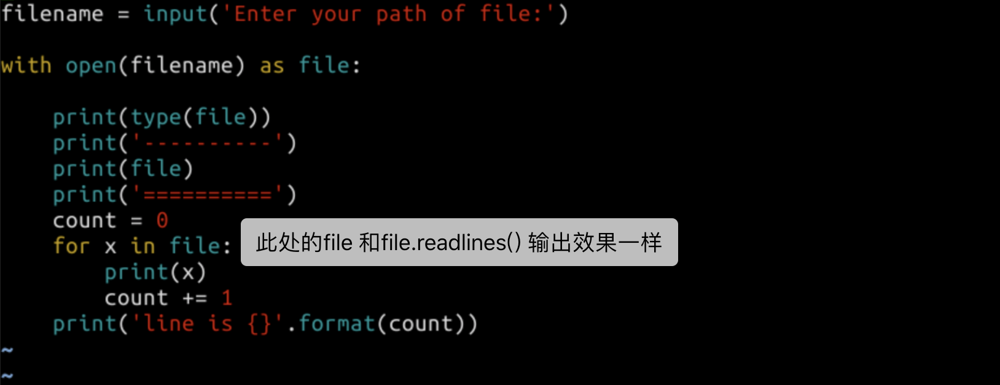
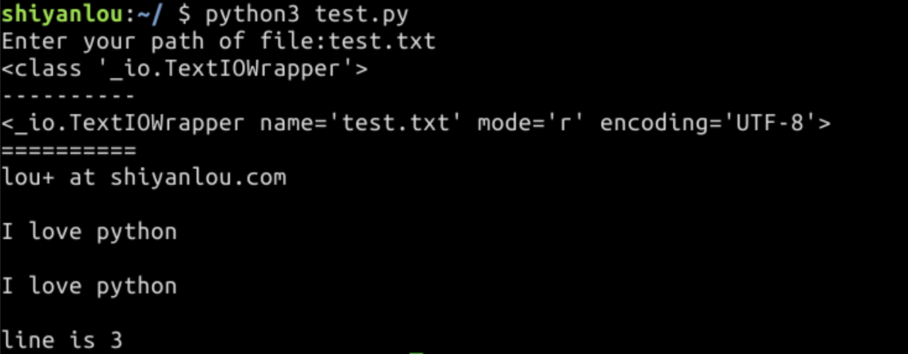

在本实验中，我们将学习如何使用 Python 进行下列的文件处理：

打开与关闭文件
读取文件内容
写入文件
pickle 和 JSON 序列化
os.path 文件与文件夹操作
知识点

打开与关闭文件
读取与写入文件
按行读取文件
pickle 序列化
JSON 序列化
os.path 模块

---
## 打开与关闭

我们使用 open() 函数打开文件。这个函数将返回一个文件对象，我们对文件的读写都将使用这个对象。

open() 函数需要两个参数，第一个参数是文件路径或文件名，第二个是文件的打开模式。模式通常是下面这样的：

- "r"，以只读模式打开，你只能读取文件但不能编辑/删除文件的任何内容
- "w"，以写入模式打开，如果文件存在将会删除里面的所有内容，然后打开这个文件进行写入
- "a"，以追加模式打开，写入到文件中的任何数据将自动添加到末尾
- "b"，以二进制的方式打开

默认的模式为只读模式，也就是说如果你不提供任何模式，open() 函数将会以只读模式打开文件。

我们将实验打开一个文件，进入 Python 交互模式打开这个文件：
```
>>> file = open('/etc/protocols')
>>> type(file)
<class '_io.TextIOWrapper'>
>>> file
<_io.TextIOWrapper name='/etc/protocols' mode='r' encoding='UTF-8'>
```
从上面的信息，可以看到打开的文件 /etc/protocols，打开的模式为只读模式 r，编码方式为 UTF-8。

当程序执行结束后，我们需要关闭文件，如果不关闭会持续占用一些内存和操作系统资源，不关闭的文件也有可能造成数据丢失。我们使用方法 close() 完成这个操作，重复关闭不会有任何影响：
```
>>> file.close()
>>> file
<_io.TextIOWrapper name='/etc/protocols' mode='r' encoding='UTF-8'>
>>> file.close()
```
在实际情况中，我们应该尝试使用 with 语句处理文件对象，它会在文件用完后自动关闭，就算发生异常也没关系。它是 try-finally 块的简写：
```
>>> with open('/etc/protocols') as file:
...     count = 0
...     for line in file:
...         count += 1
...     print(count)
...
64
```


这个程序中我们将打印文件的行数，可以看到代码块中并没有使用 close，但当代码执行到 with 代码块之外时，文件会被自动关闭。

**with ... as ...**
```Python
class controlled_execution:
    def __enter__(self):
        set things up
        return thing
    def __exit__(self, type, value, traceback):
        tear things down

with controlled_execution() as thing:
        do something

```
在python2.5及以后，file对象已经写好了enter和exit函数，我们可以这样测试：
```python
>>> f = open("x.txt")
>>> f  
<open file 'x.txt', mode 'r' at 0x00AE82F0>
>>> f.__enter__()
<open file 'x.txt', mode 'r' at 0x00AE82F0>
>>> f.read(1)
'X'
>>> f.__exit__(None, None, None)
>>> f.read(1)
Traceback (most recent call last):
    File "<stdin>", line 1, in <module>
ValueError: I/O operation on closed file

```

## 读取文件内容

此处我们先用 echo 命令创建一个文件，这个文件的内容包括两行：
```
I love python
lou+ at shiyanlou.com
```
创建的文件路径为 /home/shiyanlou/test.txt，创建的命令：
```
$ echo 'I love Python' > /home/shiyanlou/test.txt
$ echo 'lou+ at shiyanlou.com' >> /home/shiyanlou/test.txt
$ cat test.txt
I love Python
lou+ at shiyanlou.com

使用 read() 可以一次性读取整个文件的内容到字符串：

>>> filename = '/home/shiyanlou/test.txt'
>>> file = open(filename)
>>> file.read()
'I love Python\nlou+ at shiyanlou.com\n'
>>> file.close()
当然也可以使用 with，避免忘记了 close：

>>> filename = '/home/shiyanlou/test.txt'
>>> with open(filename) as file:
...     file.read()
...
```

**项目开发中，我们需要谨慎使用 read() 读取整个文件，因为有可能你的系统内存并不足够存储整个文件的内容。当 read() 执行后，再次执行将不会有任何内容的输出。**

在处理文本文件的时候，我们通常会采用逐行处理，readline() 就是用来每次读取文件的一行，readlines() 可以读取所有行，但不同于 read()，这个函数返回的是一个列表，列表中每个元素都是对应文本文件中一行内容的字符串：
```
>>> filename = '/home/shiyanlou/test.txt'
>>> file = open(filename)
>>> file.readline()
'I love Python\n'
>>> file.readline()
'lou+ at shiyanlou.com\n'
>>> file.close()
由于使用了两次 readline() 再次使用 readlines() 将不会有任何输出，所以我们需要再次重新打开文件：

>>> file = open(filename)
>>> file.readlines()
['I love Python\n', 'lou+ at shiyanlou.com\n']
>>> file.close()
你可以 for 循环遍历文件对象来读取文件中的每一行：

>>> file = open(filename)
>>> for x in file:
...     print(x, end = '')
...
I love Python
lou+ at shiyanlou.com
>>> file.close()

```

## 实现文件内容统计程序




## 写入文件

最常用的写入文件的方法是 write()，让我们通过 write() 方法打开一个文件然后我们随便写入一些文本。
```
>>> filename = '/home/shiyanlou/test.txt'
>>> with open(filename, 'w') as file:
...     file.write('testline1')
...     file.write('testline2')
...
9
9
这个程序中，我们将文件以 'w' 模式打开，然后写入两段内容，执行过程中输出的两个 9 分别表示两次写入的字符数量。

查看刚刚写入完成的文件内容，是否已经变化，仍然使用 readlines() 查看：

现在读取我们刚刚创建的文件。

>>> with open(filename, 'r') as file:
...     print(file.readlines())
...
['testline1testline2']
这时候发现文件中原来的内容已经被完全覆盖了，并且写入的内容占了一行（因为没有写入换行符的原因）。

如果我们想向文件中增加内容如何操作呢？可以使用 'a' 追加模式打开文件：

>>> filename = '/home/shiyanlou/test.txt'
>>> with open(filename, 'a') as file:
...     file.write('testline3')
...     file.write('testline4')
...
9
9
再次读取，可以看到新增加的字符串附加到了原来的内容后面：

>>> with open(filename, 'r') as file:
...     print(file.readlines())
...
['testline1testline2testline3testline4']

```


## 拷贝文件示例

在这个例子里我们拷贝给定的文本文件到另一个给定的文本文件，实现类似 Linux 上的 cp 命令，这个程序可以接受两个参数，第一个参数为要拷贝的文件，第二个参数为拷贝后的新文件的路径，代码如下，请理解每一行的代码：
```python
#!/usr/bin/env python3

import sys

def copy_file(src, dst):
    with open(src, 'r') as src_file:
        with open(dst, 'w') as dst_file:
            dst_file.write(src_file.read())

if __name__ == '__main__':
    if len(sys.argv) == 3:
        copy_file(sys.argv[1], sys.argv[2])
    else:
        print("Parameter Error")
        print(sys.argv[0], "srcfile dstfile")
        sys.exit(-1)
    sys.exit(0)
```

---
os.\_exit() 和 sys.exit()

os.\_exit() vs sys.exit()
概述

python的程序有两中退出方式：os.\_exit()， sys.exit()。本文介绍这两种方式的区别和选择。

os.\_exit()会直接将python程序终止，之后的所有代码都不会继续执行。

sys.exit()会引发一个异常：SystemExit，如果这个异常没有被捕获，那么python解释器将会退出。如果有捕获此异常的代码，那么这些代码还是会执行。捕获这个异常可以做一些额外的清理工作。0为正常退出，其他数值（1-127）为不正常，可抛异常事件供捕获。

---

你可以看到我们在这里使用了一个新模块 sys。sys.argv 包含所有命令行参数。

sys.argv 的第一个值 sys.argv[0] 是程序自身的名字，下面这个程序打印命令行参数：
```python
#!/usr/bin/env python3

import sys
print("Program:", sys.argv[0])
print("Parameters:")
for i, x  in enumerate(sys.argv):
    if (i == 0):
        continue
    print(i, x)
运行程序：

$ ./argvtest.py lou+ shiyanlou.com
Program: ./argvtest.py
Parameters:
1 lou+
2 shiyanlou.com
```
这里我们用到了一个新函数 enumerate(iterableobject)，在列表中循环时，索引位置和对应值可以使用它同时得到。这里在参数列表中使用 continue 去除了 sys.argv[0] 程序自身的名字。


---

#### enumerate()说明

enumerate()是python的内置函数
enumerate在字典上是枚举、列举的意思
对于一个可迭代的（iterable）/可遍历的对象（如列表、字符串），enumerate将其组成一个索引序列，利用它可以同时获得索引和值
enumerate多用于在for循环中得到计数
例如对于一个seq，得到：

(0, seq[0]), (1, seq[1]), (2, seq[2])

enumerate()返回的是一个enumerate对象。

#### enumerate()使用

如果对一个列表，既要遍历索引又要遍历元素时，首先可以这样写：
list1 = ["这", "是", "一个", "测试"]
for i in range (len(list1)):
    print i ,list1[i]

上述方法有些累赘，利用enumerate()会更加直接和优美：
```
list1 = ["这", "是", "一个", "测试"]
for index, item in enumerate(list1):
    print index, item
>>>
0 这
1 是
2 一个
3 测试

enumerate还可以接收第二个参数，用于指定索引起始值，如：
list1 = ["这", "是", "一个", "测试"]
for index, item in enumerate(list1, 1):
    print index, item
>>>
1 这
2 是
3 一个
4 测试
```

#### 补充

如果要统计文件的行数，可以这样写：

count = len(open(filepath, 'r').readlines())

这种方法简单，但是可能比较慢，当文件比较大时甚至不能工作。

可以利用enumerate()：

count = 0
for index, line in enumerate(open(filepath,'r'))：
    count += 1

---


## pickle 和 JSON 序列化

如果我们想用文本文件保存一个 Python 对象怎么操作？
这里就涉及到序列化的问题，序列化指的是将内存中的对象转化为可以存储的格式。Python 中最常用两种方式进行序列化：

- pickle 模块
- JSON 格式


我们首先通过一个实例将 Python 的一个字典存入到文件中并读取出来恢复成字典对象，这个过程中用的就是 pickle 模块：
```
>>> import pickle
>>> courses = { 1:'Linux', 2:'Vim', 3:'Git'}
>>> with open('./courses.data', 'wb') as file:
...     pickle.dump(courses, file)
...
>>> with open('./courses.data', 'rb') as file:
...     new_courses = pickle.load(file)
...
>>> new_courses
{1: 'Linux', 2: 'Vim', 3: 'Git'}
>>> type(new_courses)
<class 'dict'>
>>>
注意写入和读取文件都需要使用 b 二进制模式。
```
最终我们写入文件并读取后仍然可以恢复到原来的字典对象。如果只是想将对象序列化成一个字节流，那可以使用 pickle.dumps(obj)


JSON(JavaScript Object Notation, JS 对象标记)是一种轻量级的数据交换格式。JSON 格式在互联网应用开发中应用非常广泛，可以作为不同的服务组件之间进行数据传递的格式。在互联网应用提供的各种 API 接口返回值基本都是 JSON 格式。Python 也提供了 json 模块支持 JSON 序列化，仍然用上面的例子，我们用 JSON 的格式进行序列化：

```
>>> import json
>>> courses = { 1:'Linux', 2:'Vim', 3:'Git'}
>>> json.dumps(courses)
'{"1": "Linux", "2": "Vim", "3": "Git"}'
>>> with open('courses.json', 'w') as file:
...     file.write(json.dumps(courses))
...
38
>>> with open('courses.json', 'r') as file:
...     new_courses = json.loads(file.read())
...
>>> new_courses
{'1': 'Linux', '2': 'Vim', '3': 'Git'}
>>> type(courses)
<class 'dict'>
dumps 和 loads 分别执行了序列化和反序列化的操作，并且 JSON 序列化后的内容为字符串，所以文本写入和读取不需要用二进制格式。
```

## os.path 文件与文件夹操作

在这里简单介绍下 os.path 这个非常常用的标准库，这个库主要的用途是获取和处理文件及文件夹属性。

下面代码举例介绍几个常用的方法，更多的内容在使用到的时候查阅文档。
>
> os.path.abspath(path) 返回文件的绝对路径
os.path.basename(path) 返回文件名
os.path.dirname(path) 返回文件路径
os.path.isfile(path) 判断路径是否为文件
os.path.isdir(path) 判断路径是否为目录
os.path.exists(path) 判断路径是否存在
os.path.join(path1[, path2[, ...]]) 把目录和文件名合成一个路径


实验代码内容，需要在 Python 交互环境中操作：
```
>>> import os
>>> filename = '/home/shiyanlou/test.txt'
>>> os.path.abspath(filename)
'/home/shiyanlou/test.txt'
>>>
>>> os.path.basename(filename)
'test.txt'
>>> os.path.dirname(filename)
'/home/shiyanlou'
>>>
>>> os.path.isfile(filename)
True
>>>
>>> os.path.isdir(filename)
False
>>> os.path.exists(filename)
True
>>> os.path.join('/home/shiyanlou', 'test.txt')
'/home/shiyanlou/test.txt'
>>>

```
