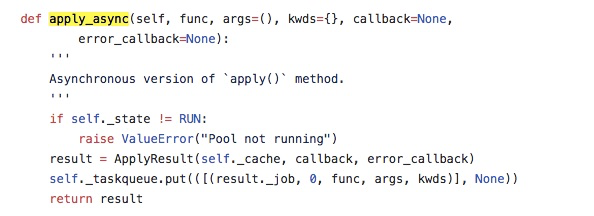

## 多进程
multiprocessing下的 Process 类封装了多进程操作，我们通过一个多进程版本的程序来看看它的使用方法，该程序写入 /home/shiyanlou/multi.py：

```
import os
from multiprocessing import Process

def hello(name):
    print('child process: {}'.format(os.getpid()))
    print('Hello ' + name)

def main():
     # 注意：args 参数要以 tuple 方式传入
    p = Process(target=hello, args=('shiyanlou', ))
    p.start()
    p.join()
    print('parent process: {}'.format(os.getpid()))

if __name__ == '__main__':
    main()

```

在上面的程序中，首先从 multiprocessing 中导入 Process 类，然后 定义了一个 hello 函数，打印 hello + 传入的 name 值，在 main 函数中，用 Process 类定义了一个子进程，这个子进程要执行的函数是 hello，传入的参数是 shiyanlou，然后调用 start() 方法，启动子进程，这时候子进程会调用 hello 函数，将 shiyanlou 作为参数传入，打印当前进程 id 和 hello shiyanlou 后返回。 join() 方法表示等待子进程运行结束后继续执行，所以在子进程返回后会继续打印父进程的 id。

运行这个程序，会输出

```
$ cd /home/shiyanlou
$ python3 multi.py
child process: 60901                                                                                                  
Hello shiyanlou                                                                                                       
parent process: 60900

```
## 进程间通信


进程有自己独立的运行空间，这就意味要使用一些特殊的手段才能实现它们之间的数据交换。multiprocessing 模块提供了 Pipe 和 Queue 两种方式。

#### Pipe

如果把两个进程想象成两个密封的箱子，那 Pipe 就像是连接两个箱子的一个管道，借助它可以实现两个箱子简单的数据交换。看一下它的使用方法：

```
from multiprocessing import Pipe
conn1, conn2 = Pipe()
```

Pipe() 返回一个 tuple，包含两个连接。默认情况下，打开的管道是全双工的，也就是说你可以在任何一段读写数据，写入数据使用 send 方法，读取数据使用 recv 方法。下面看一个例子：


```
from multiprocessing import Process, Pipe

conn1, conn2 = Pipe()

def f1():
    conn1.send('Hello shiyanlou')

def f2():
    data = conn2.recv()
    print(data)

def main():
    Process(target=f1).start()
    Process(target=f2).start()

if __name__ == '__main__':
    main()

```

这个程序启动了两个进程，第一个进程在 f1 函数中向 pipe 管道写入 Hello shiyanlou，第二个进程在 f2 函数中从管道中读取数据并打印。


#### Queue

除了 Pipe 外，multiprocessing 模块还实现了一个可以在多进程下使用的队列结构 Queue，使用 Queue 改写上面的程序：


```
from multiprocessing import Process, Queue

queue = Queue()

def f1(q):
    q.put('Hello shiyanlou')

def f2(q):
    data = q.get()
    print(data)

def main():
    Process(target=f1, args=(queue,)).start()
    Process(target=f2, args=(queue,)).start()

if __name__ == '__main__':
    main()


```

Queue 可以在初始化时指定一个最大容量：
> queue = Queue(maxsize=10)

另外通过 Queue.empty() 方法可以判断队列中是否为空，是否还有数据可以读取，如果返回为 True 表示已经没有数据了。


```python
情况1:
from multiprocessing import Process, Queue

queue = Queue()

def f1(q):
    q.put('Hello shiyanlou')
#    q.put('zhihou')
def f3(q):
    q.put('charu')

def f2(q):
    data = q.get()
    print(data)

def main():
    Process(target=f1, args=(queue,)).start()
    Process(target=f3, args=(queue,)).start()
    Process(target=f2, args=(queue,)).start()
#    Process(target=f2, args=(queue,)).start()
    print(queue.empty())
if __name__ == '__main__':
    main()
    print(queue.empty())
=======================================================================
    shiyanlou:~/ $ python3 queueceshi.py                                 [22:27:59]
    False
    False
    Hello shiyanlou
```

这里留一个猜想：
多个写进程按先进后出X 随机

同个写进程的多个数据按先进先出


## 进程同步

看一个例子，有一个计数器 i，初始值为 0，现在起 10 个进程，每个进程对 i 进行 50 次加 1 操作，也就是说理论上最后的结果是 500。

这个 Value 对象可以在多进程之间共享，可以使用 help(Value) 查看参数，第一个参数是共享的数据类型，i 指的是 ctyps.c_int 就是整数，0 是Value对象中共享的值，在进程中可以通过 val.value 获取。

代码：

```
import time
from multiprocessing import Process, Value

def func(val):
    for i in range(50):
        time.sleep(0.01)
        val.value += 1

if __name__ == '__main__':
    # 多进程无法使用全局变量，multiprocessing 提供的 Value 是一个代理器，
     # 可以实现在多进程中共享这个变量
    v = Value('i', 0)
    procs = [Process(target=func, args=(v,)) for i in range(10)]

    for p in procs:
        p.start()
    for p in procs:
        p.join()

    print(v.value)

```

由于多进程的推进顺序是无法预测的，有可能出现几个进程同时对 i 进行加 1 操作，但由于 CPU 和内存的读写机制造成只有一个进程的加 1 的操作会被记录下来，这就导致最后的结果应该是小于 500 的.

正确的做法是每次进行加 1 操作时候，为 i 加一把锁，也就是说当前的进程在操作 i 时，其它进程不能操作它。multiprocessing 模块的 Lock 类封装的锁操作，使用 acquire() 方法获取锁，release() 方法释放锁。下面是修正后的代码：

```
import time
from multiprocessing import Process, Value, Lock

def func(val, lock):
    for i in range(50):
        time.sleep(0.01)
        # with lock 语句是对下面语句的简写：
        #
        # lock.acquire()
        # val.value += 1
        # lock.release()
        #
        with lock:
            val.value += 1

if __name__ == '__main__':

    v = Value('i', 0)
    ＃ 初始化锁
    lock = Lock()
    procs = [Process(target=func, args=(v, lock)) for i in range(10)]

    for p in procs:
        p.start()
    for p in procs:
        p.join()

    print(v.value)

```


## 进程池

进程池（Pool）维持一个固定数量的进程，当有任务到来时，就去 pool 中取一个进程处理任务，处理完后，进程被返回进程池。如果一个任务到来而 pool 中的进程被用完了，那么任务就需要等待某一个进程执行完。


下面用一个进程池打印输出30次范围在0～29之间的数字：

```
from multiprocessing import Pool

def f(i):
    print(i, end=' ')

def main():
      # 初始化一个 3 个进程的进程池
    pool = Pool(processes=3)
    for i in range(30):
           # 调用 apply 方法开始处理任务，传入任务处理函数 f，和参数 i
        pool.apply_async(f, (i,))
    pool.close()
    pool.join()

if __name__ == '__main__':
    main()

```




## 多线程
Python 的 threading 模块提供了对多线程的支持，接口和 multiprocessing 提供的多进程接口非常类似，下面我们用多线程改写一开始的多进程例子：


```
import threading

def hello(name):
      # get_ident() 函数获取当前线程 id
    print('child thread: {}'.format(threading.get_ident()))
    print('Hello ' + name)

def main():
    # 初始化一个线程，参数传递和使用 Process 一样
    t = threading.Thread(target=hello, args=('shiyanlou',))
    # 启动线程和等待线程结束，和 Process 的接口一样
    t.start()
    t.join()
    print('main thread: {}'.format(threading.get_ident()))

if __name__ == '__main__':
    main()

```
