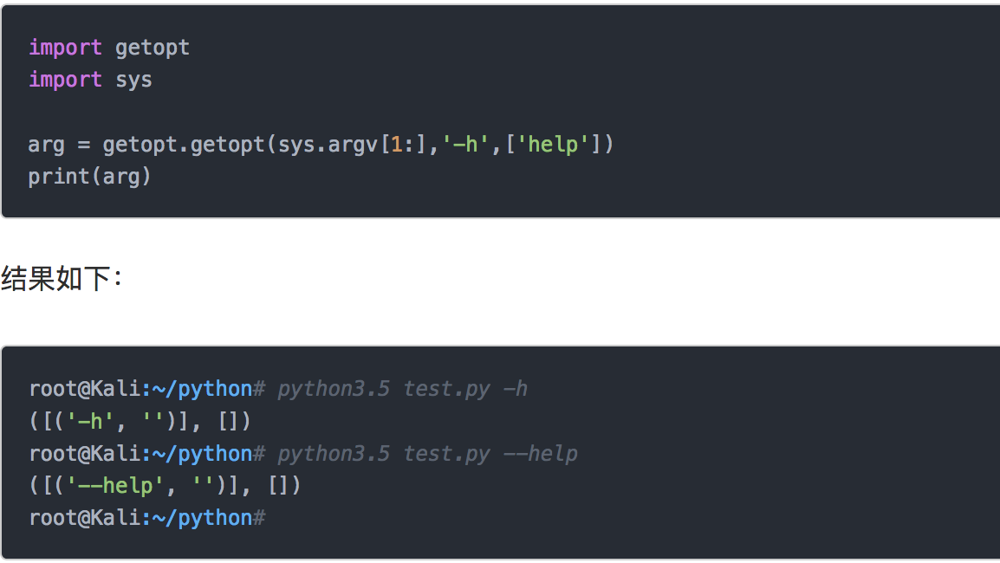
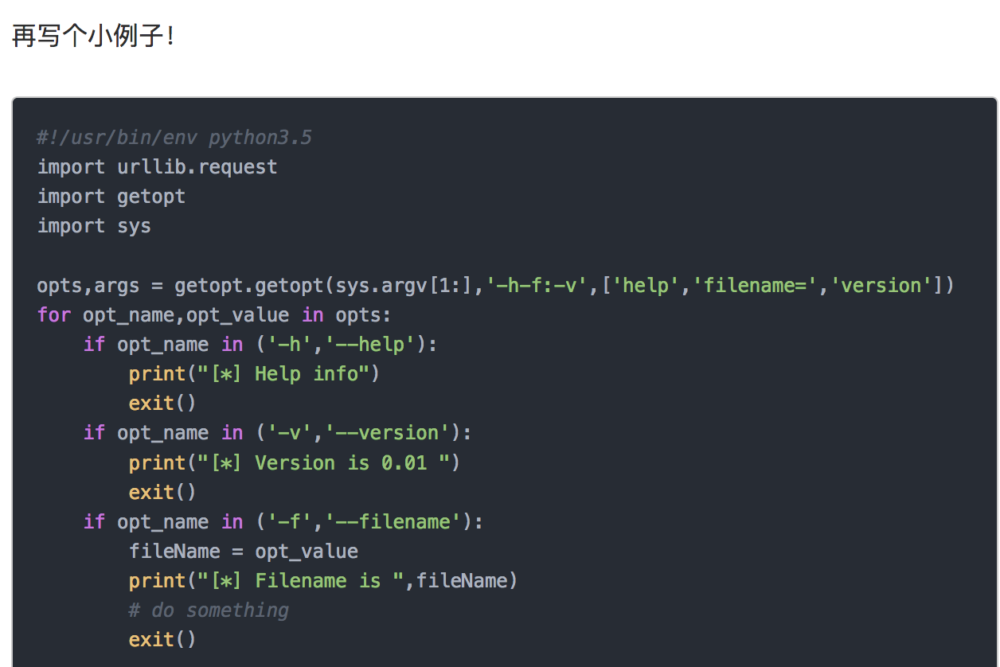

#### 实验中介绍的模块包括：

- datetime：时间日期及相关计算
- os：操作系统相关的操作
- sys：获取 Python 解释器状态
- requests：网络请求处理
- base64：二进制数据编码 64 个可打印的 ASCII 字符
- collections：提供一系列特殊的容器类


## datetime

datetime 模块提供了一些类用于操作日期时间及其相关的计算。比较常用三个类型：

date 封装了日期操作
datetime 封装日期+时间操作
timedelta 表示一个时间间隔，也就是日期时间的差值

```

>>> from datetime import date, datetime, timedelta
日期时间的获取：

# 获取当前日期
>>> date.today()
datetime.date(2017, 8, 30)

# 获得格林威治时间，即伦敦时间，比北京时间慢 8 小时
>>> datetime.utcnow()
datetime.datetime(2017, 8, 30, 6, 15, 15, 931110)

# 获得本地时间，即北京时间
>>> t = datetime.now()
>>> t
datetime.datetime(2017, 8, 30, 14, 15, 56, 887176)
>>> t.day
30
>>> t.year
2017
>>> t.minute
17

#获取差值
import datetime
begin = datetime.datetime.now()
end = datetime.datetime.now()
k = end - begin
k.total_seconds()

#datetime 对象与字符串之间的相互转换：

>>> t
datetime.datetime(2017, 8, 30, 14, 17, 56, 887176)

# 用 strftime 方法将 datetime 数据类型转换为字符串
>>> datetime.strftime(t, '%Y-%m-%d %H:%M:%S')
'2017-08-30 14:17:56'

# 用 striptime 方法将字符串转换为 datetime 数据类型
>>> datetime.strptime('2017-10-01 00:00:00', '%Y-%m-%d %H:%M:%S')
datetime.datetime(2017, 10, 1, 0, 0)
用 timedelta 表示时间差值，可以精确到微秒：

timedelta(days=0, seconds=0, microseconds=0, milliseconds=0, minutes=0, hours=0, weeks=0)
用 timedelta 对 datetime 进行加减操作：

>>> t
datetime.datetime(2017, 8, 30, 14, 17, 56, 887176)

# 所有参数均为可选参数，且默认都是 0，参数值可以是整数、浮点数、正数或负数
>>> t + timedelta(weeks=1, days=-3, hours=3, minutes=-10)
datetime.datetime(2017, 9, 3, 17, 7, 56, 887176)
```


## os

os 模块提供了一些接口来获取操作系统的一些信息和使用操作系统功能。

```

>>> import os
# 获取当前工作目录
>>> os.getcwd()
'/home/shiyanlou/Code

# 生成 n 个字节的随机数，用于加密，比如作为 Flask 的 SECRET_KEY
>>> os.urandom(24)
b'8\xbb\x88\xfc\xf2\xe8T\x99\x99C^\xc3)\xe0\xd5#6\x9e\xa5\xe7\xfb\xa0\x07G'

# 在当前目录创建一个目录
>>> os.mkdir('web-app')

# 在当前目录创建一个 app.py 文件
>>> os.mknod(os.getcwd() + '/app.py')
```
https://www.cnblogs.com/jiaxin359/p/7324077.html

- 情况1：在一个目录下面只有文件，没有文件夹，这个时候可以使用os.listdir.在我们的桌面上有一个file目录（文件夹），里面有三个文件
```
file(dir)|

    --|test1.txt

    --|test2.txt

    --|test3.txt
```
用下面的程序获得文件的绝对路径：
```
import os
path = r'C:\Users\Administrator\Desktop\file'
for filename in os.listdir(path):
    print(os.path.join(path,filename))
使用os.listdir读取到一个目录下面所有的文件名，然后使用os.path.join把目录的路径和文件名结合起来，就得到了文件的绝路路径，结果如下：

C:\Users\Administrator\Desktop\file\test1.txt
C:\Users\Administrator\Desktop\file\test2.txt
C:\Users\Administrator\Desktop\file\test3.txt
```
- 情况2：递归的情况，一个目录下面既有目录（目录下面还可能有目录和文件）也有文件，如何读取里面所有文件，使用os.walk：

os.walk介绍：

我们在桌面上面建立一个file目录，里面的组织结构如下：
```
file(dir):

     --|file1(dir):

           --|file1_test1.txt

           --|file1_test2.txt

     --|file2(dir)

           --|file2_test1.txt

     --|file_test1.txt

     --|file_test2.txt
```
运行一下代码：
```
import os
path = r'C:\Users\Administrator\Desktop\file'
for dirpath,dirnames,filenames in os.walk(path):
    print(dirpath,dirnames,filenames)
输出结果如下：

C:\Users\Administrator\Desktop\file ['file1', 'file2'] ['file_test1.txt', 'file_test2 .txt']
C:\Users\Administrator\Desktop\file\file1 [] ['file1_test1.txt', 'file1_test2.txt']
C:\Users\Administrator\Desktop\file\file2 [] ['file2_test1.txt']
os.walk输入一个路径名称，以yield的方式（其实是一个生成器）返回一个三元组 dirpath, dirnames, filenames，

dirpath为目录的路径，为一个字符串。比如上面的 C:\Users\Administrator\Desktop\file和C:\Users\Administrator\Desktop\file\file1等。

dirnames列出了目录路径下面所有存在的目录的名称。比如在 C:\Users\Administrator\Desktop\file下面有两个目录：file1和file2，那么它就列出了这个目录路径下的目录名称。

filenames列出了目录路径下面所有文件的名称。同样在 C:\Users\Administrator\Desktop\file下面有两个文件file_test1.txt和file_test2 .txt，那么程序将会列出这两个文件名。

如何获得一个路径下面所有的文件路径：

import os
path = r'C:\Users\Administrator\Desktop\file'
for dirpath,dirnames,filenames in os.walk(path):
    for filename in filenames:
        print(os.path.join(dirpath,filename))

```

得到的结果如下：
```
C:\Users\Administrator\Desktop\file\file_test1.txt
C:\Users\Administrator\Desktop\file\file_test2 .txt
C:\Users\Administrator\Desktop\file\file1\file1_test1.txt
C:\Users\Administrator\Desktop\file\file1\file1_test2.txt
C:\Users\Administrator\Desktop\file\file2\file2_test1.txt
```


## sys
https://blog.ansheng.me/article/python-standard-library-sys.html


## Requests

如果你写过爬虫，对这个库应该不陌生。在 requests 库出现之前，网络请求通常用标准库中的 urllib。requests 出现之后，它俨然已经成了 Python 事实上的网络请求标准库。

requests 的接口非常简单：
```
>>> import requests
>>> r = requests.get('https://www.shiyanlou.com')
>>> r.status_code
200
>>> r.headers['content-type']
'text/html; charset=utf-8'
>>> r.text
'\n<!DOCTYPE html>\n<html lang="zh-CN">\n    <head>\n        <meta charset="utf-8">\n        <meta http-eq...'
请求 JSON 数据：

>>> r = requests.get('https://api.github.com')
>>> r.json()
{'current_user_url': 'https://api.github.com/user', ... }
json() 方法会将返回的 JSON 数据转化为一个 Python 字典。
```
还可以用 requests 执行 POST，DELETE 等其它的 HTTP 方法。

拓展阅读 《Requests 模块官方文档 - 快速上手》
http://docs.python-requests.org/zh_CN/latest/user/quickstart.html

## base64

base64 是一种编码方式，它可以将二进制数据编码 64 个可打印的 ASCII 字符。Base64要求把每三个8Bit的字节转换为四个6Bit的字节（38 = 46 = 24），然后把6Bit再添两位高位0，组成四个8Bit的字节，也就是说，转换后的字符串理论上将要比原来的长1/3。

```
import base64
>>> base64.b64encode(b'Hello, shiyanlou!')
b'SGVsbG8sIHNoaXlhbmxvdSE='
>>> base64.b64decode(b'SGVsbG8sIHNoaXlhbmxvdSE=')
b'Hello, shiyanlou!'

```

## collections

collections 模块主要提供了一些特别的容器，在特定的情况下我们使用这些容器可以使问题处理更容易一些。

下面，我们就针对 collections 模块常见的 3 个用法举例：


## getopt模块

getopt() -- Parse command line options
gnu_getopt() -- Like getopt(), but allow option and non-option arguments
to be intermixed.
GetoptError -- exception (class) raised with 'opt' attribute, which is the
option involved with the exception.

参数

这个模块一共有两个函数，两个属性
函数：

    getopt.getopt
    getopt.gnu_getopt

属性：

    getopt.error
    getopt.GetoptError
    这两个属性主要是用来抛出错误信息的，非常友好不是吗？


我们主要经常使用getopt这个函数.

getopt.getopt(args, shortopts, longopts=[])
- args指的是当前脚本接收的参数，它是一个列表，可以通过sys.argv获得
- shortopts 是短参数　　啥是短参数啊？　　类似于　这样：python test.py -h # 输出帮助信息
- longopts 是长参数　　啥是长参数啊？　　类似于　这样：python test.py -help # 输出帮助信息


返回值
  这个函数返回是一个两元组的列表（复习一下，元组的值是不可修改的！）






来详细解释一下这几行代码
首先从短参数名开始。
我定义了'-h-f:-v' 大家发现没有，在-f后面多了一个":"
这个":"代表了当前参数是有值的，是一个参数名+参数值的参数
如果我再加一个-o: 那么证明-o后面是可以接收一个值，这个值就是-o的参数值，将会保存到opts变量中。
长参数名的方式和短参数差不多，唯一的区别就是长参数如果要接收值，那必须得在后面加上一个"="


存疑惑：
挑战五中，
python3 calculator.py -C beijing -c test.cfg -d user.csv -o gongzi.csv

如果 选择短参数-C：
那么，后面必须跟 空格+参数，否则，后面的命令讲串位导致失败。


参考：
https://www.cnblogs.com/zz22--/p/7719285.html
https://www.jianshu.com/p/a877e5b46b2d
https://www.cnblogs.com/chushiyaoyue/p/5380022.html


## configparser

1. 基本的读取配置文件

- read(filename) 直接读取ini文件内容

- sections() 得到所有的section，并以列表的形式返回

- options(section) 得到该section的所有option

- items(section) 得到该section的所有键值对

- get(section,option) 得到section中option的值，返回为string类型

- getint(section,option) 得到section中option的值，返回为int类型，还有相应的getboolean()和getfloat() 函数。

2. 基本的写入配置文件

- add_section(section) 添加一个新的section

- set( section, option, value) 对section中的option进行设置，需要调用write将内容写入配置文件。


3. 基本例子


参考：
https://www.jianshu.com/p/4202a2051668


1. OrderedDict

OrderedDict 是一个特殊的字典。字典本质上是一个哈希表，其实现一般是无序的，OrderedDict 能保持元素插入的顺序：
```
>>> from collections import OrderedDict
>>> d = OrderedDict()
>>> d['apple'] = 1
>>> d['google'] = 2
>>> d['facebook'] = 3
>>> d['amazon'] = 4
>>> d
OrderedDict([('apple', 1), ('google', 2), ('facebook', 3), ('amazon', 4)])
OrderedDict 同样能以元素插入的顺序来进行迭代或者序列化：

>>> for key in d:
...   print(key, d[key])
...
apple 1
google 2
facebook 3
amazon 4
>>> import json
>>> json.dumps(d)
'{"apple": 1, "google": 2, "facebook": 3, "amazon": 4}'

```


2. namedtuple

使用普通的元组（tuple）存在一个问题，每次用下标去获取元素，可能会不知道你这个下标下的元素到底代表什么。namedtuple 能够用来创建类似于元组的类型，可以用索引来访问数据，能够迭代，也可以通过属性名访问数据。

下面使用命名元组表示坐标系中的点：
```
>>> from collections import namedtuple
>>> Point = namedtuple('Point', ['x', 'y'])
>>> p = Point(10, 12)
>>> p.x
10
>>> p.y
12
```

```
133         IncomeTaxQuickLookupItem = namedtuple(
134                 'IncomeTaxQuickLookupItem',
135                 ['start_point','tax_rate','quick_subtractor']
136                 )
137     
138         INCOME_TAX_QUICK_LOOKUP_TABLE = [
139                 IncomeTaxQuickLookupItem(80000, 0.45, 13505),
140                 IncomeTaxQuickLookupItem(55000, 0.35, 5505),
141                 IncomeTaxQuickLookupItem(35000, 0.30, 2755),
142                 IncomeTaxQuickLookupItem(9000, 0.25, 1005),
143                 IncomeTaxQuickLookupItem(4500, 0.2, 555),
144                 IncomeTaxQuickLookupItem(1500, 0.1, 105),
145                 IncomeTaxQuickLookupItem(0, 0.03, 0)
146                 ]
147  


            for item in INCOME_TAX_QUICK_LOOKUP_TABLE:
175                 if taxable_part > item.start_point:
176                     geshuitax = taxable_part * item.tax_rate - item.quick_subtractor
177                     ressalary = salarypartone - geshuitax
178                 else:
179                     ressalary = salarypartone

```

3. Counter

Counter 用来统计一个可迭代对象中各个元素出现的次数，以字符串为例：

```
>>> from collections import Counter
>>> c = Counter('https://www.shiyanlou.com')
>>> c
Counter({'w': 3, 'h': 2, 't': 2, 's': 2, '/': 2, '.': 2, 'o': 2, 'p': 1, ':': 1, 'i': 1, 'y': 1, 'a': 1, 'n': 1, 'l': 1, 'u': 1, 'c': 1, 'm': 1})

```

找出出现次数最多的前 n 个元素：
```
>>> c.most_common(3)
[('w', 3), ('h', 2), ('t', 2)]
```
拓展阅读 《collections 模块作用和用法》
https://eastlakeside.gitbooks.io/interpy-zh/content/collections/collections.html
