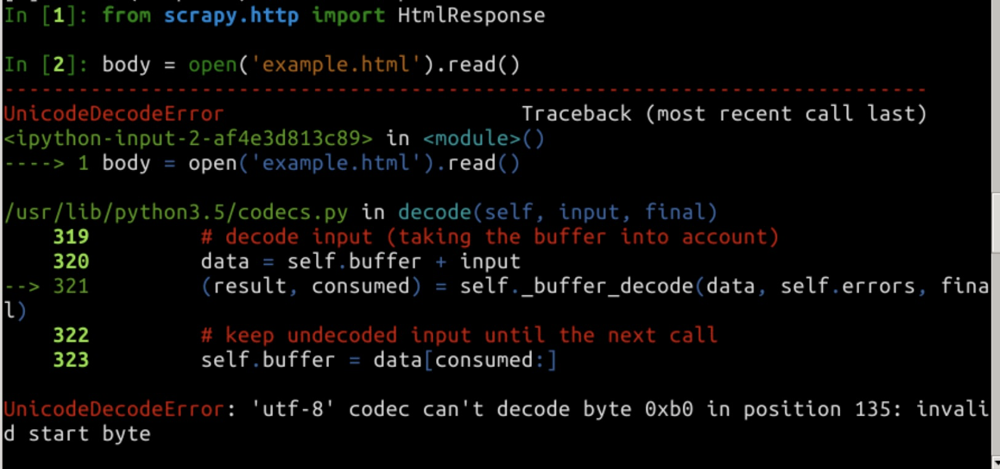
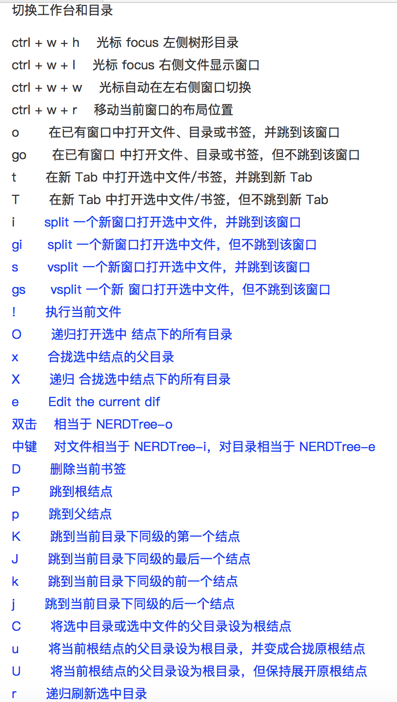
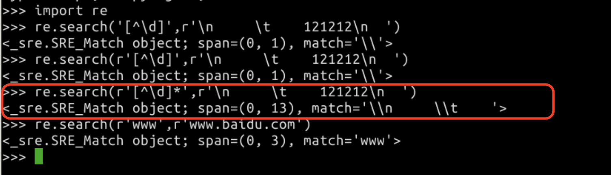

1. 类继承
Python中类分两种：经典类和新式类
新式类都从object继承，经典类不需要

- 经典类也成 旧式类, 旧式类中，类名和type是无关的：如果x是一个旧式类，那么x.\_\_class__定义了x的类名，但是type(x)总是返回<type 'instance'>。这反映了所有的旧式类的实例是通过一个单一的叫做instance的内建类型来实现的，这是它和类不同的地方。

- 新式类是在python2.2为了统一类和实例引入的。一个新式类只能由用户自定义。如果x是一个新式类的实例，那么type(x)和x.\_\_class__是一样的结果（尽管这不能得到保证，因为新式类的实例的__class__方法是允许被用户覆盖的）

```
# -*- coding:utf-8 -*-    

class E:    
#经典类  
    pass  

class E1(object):    
#新式类  
    pass  

e = E()  
print "经典类"  
print e  
print type(e)  
print e.__class__  

print "新式类"  
e1 = E1()  
print e1  
print e1.__class__  
print type(e1)
```

```
经典类  
<__main__.E instance at 0x0000000002250B08>  
<type 'instance'>  
__main__.E  

新式类  
<__main__.E1 object at 0x0000000002248710>  
<class '__main__.E1'>  
<class '__main__.E1'>
```

2. 编码问题



用 vim 打开文件，在命令模式输入： set fileencoding=utf8 即可


3. VIM 目录使用


4. 正则表达式

- \d 表示任意数字
- [\d] 就是字符集，所谓字符集，就是字符的集合，它也同样匹配任意数字
- ^ 在字符集内部，表示“非”
- 所以，[^\d] 匹配任意非数字字符
- \* 表示任意数量
- 综上：[^\d]* 匹配任意数量的非数字字符


