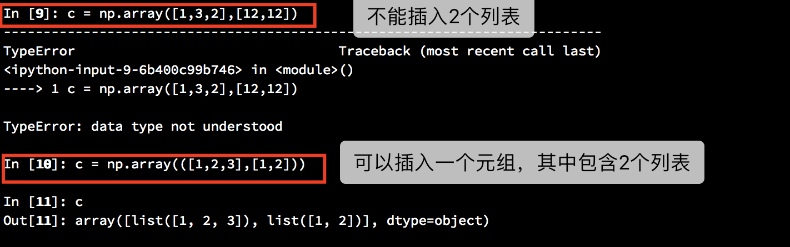
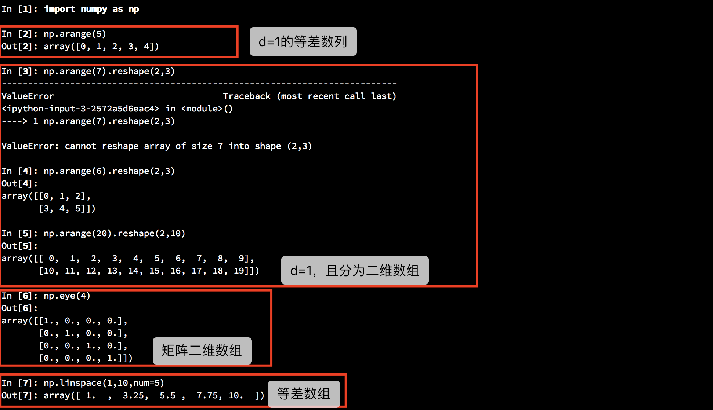

# NumPy

>支持大量高维度数组与矩阵运算,此外也针对数组运算提供大量的数学函数库。

## 实验知识点

- 创建数组
- 数组运算
- 数学函数
- 数组切片和索引
- 数组形状操作
- 数组排序
- 数组统计

1. 导入 NumPy 模块，并约定简称为 np
   import numpy as np

2. 创建数组
   Ndarray,轴-秩

   rank-多维数组，几维
   纬度-从外向内

   - 创建一维数组
   
   

   - 创建二维数组
   
   

   - 创建全为 0 的二维数组
    

   - 创建全为 1 的二维数组  
    

   - 等差数组，矩阵数组
    

   - 随机数组（随机整数数组（例子中小于5的二维2*3数组））
    

   - 依据自定义函数创建数组 np.fromfunction(lambda i, j: i + j, (3, 3))  -- **实质是数组计算**
   
   (3,3)的意思
   

3. 数组运算
   - 一维数组四则运算
   
   - 二维数组/矩阵
   
   
   
   **这边矩阵的求逆需要复习线性代数中的知识，留白。**

4. 三角函数
   

5. 数组切片和索引   

---
29

   ---
   小知识：  
  [*args和**kwargs](https://www.jianshu.com/p/d69fe2d45566)
  使用*args和**kwargs并不是必须的。只有*(星号)是必须的。你也可以写成*var和**vars。使用*args和**kwargs只是一种传统。  

  *args和**kwargs大多数时候被用在函数的声明中。*args和**kwargs允许你向函数传递可变数量的参数。也就是说当你不确定将会向函数传递多少个参数的时候你就可以使用这两个参数。    

  - \*args被用来传递一个不确定长度的、非KV式的参数列表。
    
  - \*\*kwargs允许你传递一个不确定长度的、KV式的参数给函数。如果你想在函数中处理这样的参数，你应该使用**kwargs。
    
  - 使用*args和**kwargs来调用函数
    
  - 使用*args和**kwargs和常规参数的顺序：  
    如果你想在一个函数中同时使用他们仨，使用顺序是：  
    >some_func(fargs, *args, **kwargs)  
