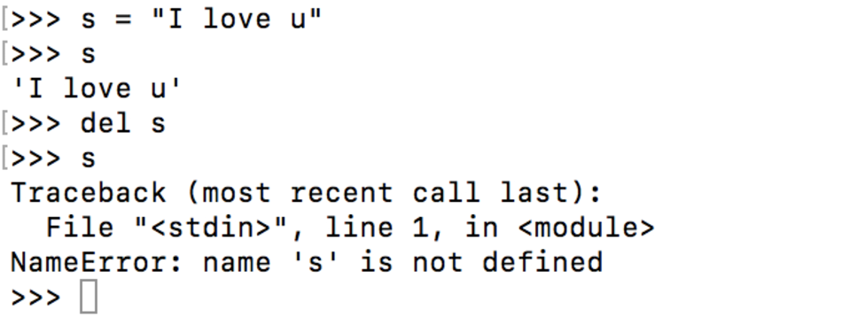

 **实验安排如下**：
```
1. 定义简单的类
2. __init__ 方法
3. Python 中的继承
4. 多继承
5. 删除对象
6. 属性读取方法
7. @property 装饰器
```
目录

[TOC]

# 1. 定义类

```python
 class nameoftheclass(parent_class):
     statment1
     statment2
     statment3
```
在类的声明中，你可以定义函数（方法）。

```python
class MyClass(object):
    """A simple example class"""
    i = 12345
    def f(self):
        return 'hello world'

```

# 2. \_\_init\_\_ 方法


类的实例化使用函数符号。只要将类对象看作是一个返回新的类实例的无参函数即可。例如：

    x = MyClass()

这个实例化操作创建一个空的对象。很多类希望创建有初始状态的类对象，故定义一个名为 __init__() 的特殊方法，如下：

    def __init__(self):
        self.data = []

类定义类 __init__() 方法，类的实例化操作会自动为新创建的类实例调用 __init__() 方法。所以在下例中：

```python
class Complex:
    def __init__(self,realpart,imagpart)
        self.r = realpart
        self.i = imagpart


>>> x = Complex(3.0,-4.5)
>>> x.r, x.i
    (3.0,-4.5)

```

# 3. 继承
  当一个类继承另一个类的时候，它将继承父类所有的功能（变量和方法）。有助于重用代码。在下面这个例子中，我们首先创建Person类，然后创建派生类Student和Teacher。当两个类都从Person类继承时，它们除了会有Person类的所有方法，还会有自身用途的信方法和新变量。

  **Student_teacher.py**

```python
#!/usr/bin/env python3

class Person(object):
    """
    返回具有给定名称的 Person 对象
    """
    def __init__(self, name):
        self.name = name
    def get_details(self):
        """
        返回包含任命的字符串
        """
        return self.name

class Student(Person):
    def __init__(self,name,branch,year):
        Person.__init__(self,name)
        self.branch = branch
        self.year = year
    def get_details(self):
        return "{} studies {} and is in {} year.".format(self.name,self.branch.self.year)


class Teacher(Person):
    """
     返回Teacher 对象，采用字符串列表作为参数    
    """
    def __init__(self,name,papers):        
        Person.__init__(self,name)
        self.papers = papers
    def get_details(self):
        return "{} teacher {}".format(self.name,','.join(self.papers))       

Person1 = Person('Mike')
Student1 = Student('amy','math',1994)
teacher1 = Teacher("dd",['C++','C'])

print(Person1.get_details())
print(Student1.get_details())
print(teacher1.get_details())

```  

# 4. 多继承
一个类可以继承自多个类，具有父类的所有变量和方法
```python

class MyClass(Parentclass1.Parentclass2,...):
    def __init__(self):
        Parentclass1.__init__(self)
        Parentclass2.__init__(self)
        ...
        ...
```

- 这里解释一下Python super() 函数  
super() 函数是用于调用父类(超类)的一个方法。super 是用来解决多重继承问题的，直接用类名调用父类方法在使用单继承的时候没问题，但是如果使用多继承，会涉及到查找顺序（MRO）、重复调用（钻石继承）等种种问题。MRO 就是类的方法解析顺序表, 其实也就是继承父类方法时的顺序表。

- 以下是 super() 方法的语法:  

    super(type[, object-or-type])    
    - type -- 类。  
    - object-or-type -- 类，一般是 self  

- Python3.x 和 Python2.x 的一个区别是: Python 3 可以使用直接使用 super().xxx 代替 super(Class, self).xxx

```python
class FooParent(object):
    def __init__(self):
        self.parent = "I am parent"
        print ("Parent")
    def bar(self,message):
        print("%s from parent" % message)     

class FooChild(FooParent):
    def __init__(self):
        super.(FooParent,self).__init__
    #python3     super.().__init__     
        print('Child')
    def bar(self,message):
        super(FooParent, self).bar(message)   
        print('Child bar fuction')
        print(self.parent)

if __name__ == '__main__':
    foochild = FooChild()
    foochild.bar('HellWorld')

>>>输出结果：

Parent
Child
HelloWorld from Parent
Child bar fuction
I'm the parent.

```

**super 其实和父类没有实质性的关联**  

**多重继承**

```python
class Base(object):
    def __init__(self):
        print "enter Base"
        print "leave Base"

class A(Base):
    def __init__(self):
        print "enter A"
        super(A, self).__init__()
        print "leave A"

class B(Base):
    def __init__(self):
        print "enter B"
        super(B, self).__init__()
        print "leave B"

class C(A, B):
    def __init__(self):
        print "enter C"
        super(C, self).__init__()
        print "leave C"

```

**继承关系**  

  &nbsp;&nbsp;&nbsp;Base  
  &nbsp;&nbsp;/&nbsp;&nbsp;&nbsp;&nbsp;&nbsp;&nbsp;&nbsp;  \  
&nbsp;A&nbsp;&nbsp;&nbsp;&nbsp;&nbsp;&nbsp;&nbsp;&nbsp;&nbsp;B  
&nbsp;\&nbsp;&nbsp;&nbsp;&nbsp;&nbsp;&nbsp;&nbsp;&nbsp;&nbsp;&nbsp;/  
&nbsp;&nbsp;&nbsp;\ &nbsp;&nbsp;&nbsp;&nbsp;&nbsp;/   
 &nbsp;&nbsp;&nbsp;&nbsp;&nbsp;&nbsp;C  

 输出：

```
c = C()        
enter C  
enter A  
enter B  
enter Base  
leave Base  
leave B  
leave A  
leave C  

```


 MRO 列表

 事实上，对于你定义的每一个类，Python 会计算出一个方法解析顺序（Method Resolution Order, MRO）列表，它代表了类继承的顺序，我们可以使用下面的方式获得某个类的 MRO 列表：

```
>>> C.mro()  
  # or C.__mro__ or C().__class__.mro()
[__main__.C, __main__.A, __main__.B, __main__.Base, object]
```

 - 子类永远在父类前面
 - 如果有多个父类，会根据它们在列表中的顺序被检查
 -  如果对下一个类存在两个合法的选择，选择第一个父类

---
## super 原理

super 的工作原理如下
```python
def super(cls, inst):
    mro = inst.__class__.mro()
    return mro[mro.index(cls) + 1]
```
其中，cls 代表类，inst 代表实例，上面的代码做了两件事：

获取 inst 的 MRO 列表
查找 cls 在当前 MRO 列表中的 index, 并返回它的下一个类，即 mro[index + 1]
当你使用 super(cls, inst) 时，Python 会在 inst 的 MRO 列表上搜索 cls 的下一个类。

现在，让我们回到前面的例子。

首先看类 C 的 __init__ 方法：

    super(C, self).__init__()

这里的 self 是当前 C 的实例，self.__class__.mro() 结果是：

    [__main__.C, __main__.A, __main__.B, __main__.Base, object]

可以看到，C 的下一个类是 A，于是，跳到了 A 的 __init__，这时会打印出 enter A，并执行下面一行代码：

    super(A, self).__init__()

注意，这里的 self 也是当前 C 的实例，MRO 列表跟上面是一样的，搜索 A 在 MRO 中的下一个类，发现是 B，于是，跳到了 B 的 __init__，这时会打印出 enter B，而不是 enter Base。

- 事实上，super 和父类没有实质性的关联。
- super(cls, inst) 获得的是 cls 在 inst 的 MRO 列表中的下一个类。

# 5. 删除对象

以上是创建对象，看一下如何删除对象。
```python
>>> s = "I love you"
>>> del s
>>> s
```





# 6. 属性读取方法
在JAVA中常用属性读取方法（getters,setters），但在python直接使用属性就可以里。
```python
class Student(object):
  def __init__(self, name):
    super(, self).__init__()
    self.name = name


```


# 7. 装饰器

更精确的调整控制属性访问权限，使用@property装饰器，@property装饰器负责把一个方法变成属性调用的。

下面的例子中，确保没人能设置金额为负，且有个只读属性cny返回换算人民币后的金额。

```python
class Account(object):
  """账号类，
  account是美元金额。
  """
def __init__(self, rate):
    self.__amt = 0
    self.rate = rate

@property
def amount(self):
    """账号余额(美元)"""
    return self.__amt

@property
def cny(self):
    """账号余额（人民币）"""
    return self.__amt * self.rate

@amount.setter
def amount(self,value):
    if value < 0 :
        print("Sorry")
        return
    self.__amt = value

if __name__ == '__main__':
    acc = Acconut(rate=6.6)
    acc.amount = 20
    print("Dollar amount:", acc.amount)
    print("In CNY:", acc.cny)
    acc.amount = -100
    print("Dollar amount:", acc.amount)               

```

在Python中

可以使用@property 装饰器将一个直接访问的属性转变为函数触发式属性。如下所示，使用@property前的代码为
```python
class Person:
    def __init__(self, name):
        self.name = name

person = Person("Tom")
>>>print(person.name)
tom
```

使用@property

```python
class Person:
    def __init__(self, name):
        self.name = name

    @property #getter方法
    def name(self):
        return self._name

    @name.setter  #在setter方法中可以约束属性,非str将捕获一个type错误
    def name(self,name):
         if not isinstance(name, str):
            raise TypeError("Expected a string")
         self._name = name

p = Person('tom')
>>>print(p.name)
tom

>>>p1 = Person(123)
typeerror:Expected a string

```

还可以只给getter方法，不写setter方法，相当于对参数的写入保护
```python
class Person(object):
    def __init__(self,age):
        self.age=age

    @property
    def age(self):
        return self._age

    @age.setter
    def age(self,age):
        self._age=age

    @property
    def birth(self):
        return 2017-self._age

p = Person(20)
>>>print(p.age)
>>>print(p.birth)

>>>p.birth = 1997
Attribute error #birth不存在setter方法

```


---

参考资料
1. [Python:你不知道的super](http://python.jobbole.com/86787/)
2. [实验楼-Python3 简明教程-类](https://www.shiyanlou.com/courses/596/labs/2046/document)
