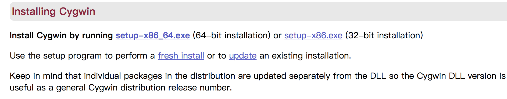
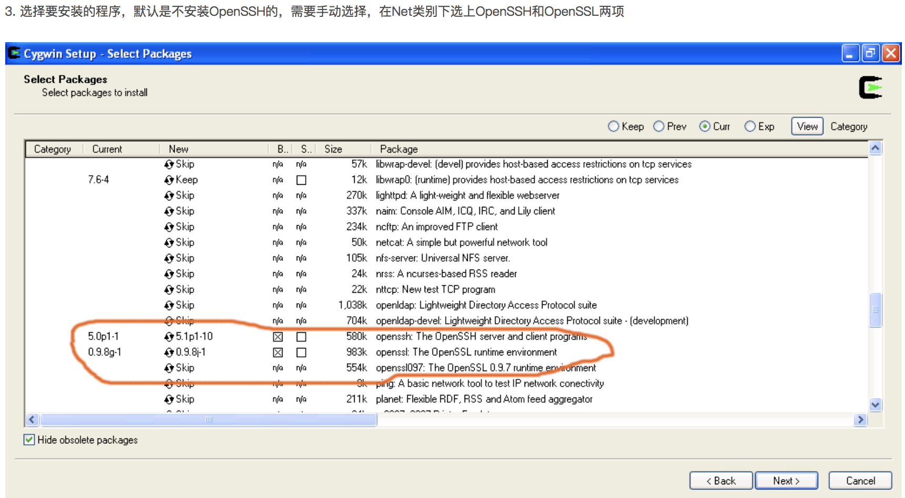

## 使用ssh登陆windows系统

**问：能否通过Linux命令ssh连接个人Windows电脑呢？**

**答：当然可以，方法还很多。大致分为两类。**

- 一类是Cygwin sshd-server这种在windows上面兼容linux二进制执行的。用起来和linux差不多。
- 一类是使用ssh协议，但是登录后的脚本环境是CMD的。git-bash运行sshd就是这种效果。

以上问答摘自网上，笔者目前只实现了第一种方式，下面就来介绍一下这种方法：


#### 1. 下载cygwin
http://www.cygwin.com/


#### 2. 运行setup.exe

我们看到有三种安装模式：

- Install from Internet，这种模式直接从Internet安装，适合网速较快的情况；
- Download Without Installing，这种模式只从网上下载Cygwin的组件包，但不安装；
- Install from Local Directory，这种模式与上面第二种模式对应，当你的Cygwin组件包已经下载到本地，则可以使用此模式从本地安装Cygwin。  
从上述三种模式中选择适合你的安装模式，这里我们选择第一种安装模式，直接从网上安装，当然在下载的同时，Cygwin组件也保存到了本地，以便以后能够再次安装。选中后，点击“下一步”。

#### 3. 目录
- 3.1

这一步选择Cygwin的安装目录，以及一些参数的设置。默认的安装位置是C:/cygwin/，你也可以选择自己的安装目录，然后选择“下一步”。
- 3.2

这一步我们可以选择安装过程中从网上下载的Cygwin组件包的保存位置，选择完以后，点击“下一步”
- 3.3

这一步选择连接的方式，选择你的连接方式，（**笔者这里选择系统设置**），然后点击下一步
- 3.4
会出现选择下载站点的对话框，如下图所示

在这一步，需要注意，为了获得最快的下载速度，我们首先在列表中寻找Cygwin中国镜像的地址：http://www.cygwin.cn，如果找到就选中这个地址；如果找不到这个地址，就在下面手动输入中国镜像的地址：http://www.cygwin.cn/pub/ ，再点击“Add”，然后再在列表中选中。（**此处笔者选择http://mirrors.aliyun.com/cygwin/**）选择完成后，点击“下一步”。

#### 4. 关键步骤：下载组件
- 4.1.1

- 4.1.2

- 4.1.3

笔者没有找的前两张图中的SSL，按照第三张图安装的。之后继续安装即可

#### 5. 配置cygwin
 [以管理员身份运行]桌面上的Cygwin，必须的，不然没权限创建sshd服务。
   ```
    ssh-host-config
   ```
   当询问if privilege separation should be used 时输入no.
   当询问if sshd should be installed as a service 时输入yes .
   当询问about the value of CYGWIN environment variable enter 时输入 ntsec .
   

   其余询问均输入 no
   ```
   Query: Should StrictModes be used? (yes/no) no
   Query: Should privilege separation be used? (yes/no) no
   Query: Do you want to install sshd as a service?
   Query: (Say "no" if it is already installed as a service) (yes/no) yes
   Query: Enter the value of CYGWIN for the daemon: []
   Query: Do you want to use a different name? (yes/no) no
   Query: Create new privileged user account 'cyg_server'? (yes/no) yes
   Query: Please enter the password:
   Query: Reenter:
   ```
   上面会提示创建一个用户cyg_server,并提示你输入该用户的密码，我们这里输入和用户名一样的密码cyg_server，后面会用到。
请注意cyg_server用户的创建是强制的，没有这个用户即使sshd装好也不行的，后面使用的时候会出现Connection closed的错误，本人就在这里栽了跟头，浪费了好多时间。


#### 6. 启动服务
运行cygrunsrv -S sshd启动sshd服务，自动做为windows的服务
**或：**
打开 控制面板-》管理-》服务 启动名为 CYGWIN sshd 的服务，亦可在cygwin中输入cygrunsrv --start sshd 启动sshd，
**或：**
输入cygrunsrv --stop sshd停止sshd

#### 7. 测试本机登陆SSH
- 打开cygwin，输入 ssh-keygen，当询问要filenames 和 pass phrases 的时候都点回车，接受默认的值
- 命令结束后输入 cd ~/.ssh 转到.ssh目录，输入 ls –l 应该包含两个文件：id_rsa.pub和id_rsa
- 在当前目录在.ssh中输入 cat id_rsa.pub >> authorized_keys
- 输入 ssh localhost 启动SSH。

#### 8. linux到windows的ssh免登陆配置：
- 8.1 CRT生成密钥对
  
  
  
  
  

  以下这部分的权限笔者没有修改过，也测试成功，没有authorized_keys则新建。
  > cat XXXX.pub >> authorized_keys

  

- 8.2 CRT 设置
  


#### 参考文档：
https://jingyan.baidu.com/article/7f766dafa38bfb4101e1d083.html
https://wenku.baidu.com/view/13447dffa216147916112862.html
securecrt免密码登录：
https://www.cnblogs.com/harrymore/p/8639331.html
如何在Cygwin中安装并配置SSH：
https://blog.csdn.net/yakoo5/article/details/39121811
通过cygwin安装openSSH：
http://xpenxpen.iteye.com/blog/2061856
